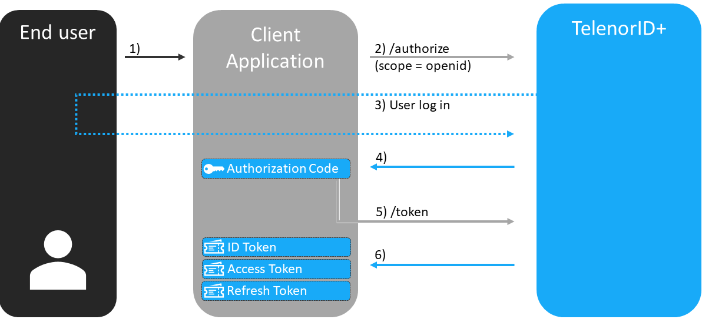

## Overview OpenID Connect (OIDC)

OpenID is an open standard and decentralized authentication protocol. It allows users to be authenticated by Telenor Norway services (known as relying parties, or RP) using a third-party identity provider (IDP) service, TelenorID\+, eliminating the need for each service to provide their own ad hoc login systems, and allowing users to log into multiple Telenor Norway services without having to have a separate identity and password for each.

OIDC is a superset of OAuth so it has some extra features.
OIDC  issues an id\_token containing basic information about the user which also can be used to verify that a user is logged in.

## Client types
It is very important to use the correct client type for your application due to different security considerations. 
[Seamless Single Sign On (SSO)](TelenorID_Plus_-_SSO.md) and [token refresh](TelenorID_Plus_-_token_refresh.md) also differs between the native and web clients.

OAuth defines two client types, based on their ability to authenticate securely with TelenorID\+ (i.e., ability to maintain the confidentiality of their client credentials):

| Client Type  | Description                                                                                             | Pros & Cons                                           |
|--------------|---------------------------------------------------------------------------------------------------------|-------------------------------------------------------|
| Confidential | Any client that will run in a secure environment and will store the client credentials in a secure way; | Benefits - can typically access all scopes.           |
|              | typically only servers. Examples are traditional back-ends or back-end for front-ends (BFFs)            | Can request refresh\_tokens ("offline access")        |
| Public       | Traditional SPAs, Native (desktop or mobile) apps                                                       | Drawbacks: Can not get a refresh\_token               |
|              |                                                                                                         | Session refresh must be done through "silent refresh" |

* See more information about client types in the [OAuth 2.0 Authorization Framework](https://datatracker.ietf.org/doc/html/rfc6749#section-2.1)
* See more information about [TelenorID\+ Client types](TelenorID_Plus_-TelenorID_Plus_-_clienttypes.md)

## Introduction to tokens
There are three types of tokens in the [OpenID connect standard](https://openid.net/specs/openid-connect-core-1_0.html), two of them is defined by the [OAuth 2.0 Authorization Framework](https://datatracker.ietf.org/doc/html/rfc6749#section-1.4) and the last one is defined by [OpenID connect standard](https://openid.net/specs/openid-connect-core-1_0.html) it self.

| Token type    | Description                                                                                                                                                                                                                           | Ref                                                                                                |
|---------------|---------------------------------------------------------------------------------------------------------------------------------------------------------------------------------------------------------------------------------------|----------------------------------------------------------------------------------------------------|
| Access Token  | Access tokens are credentials used to access protected resources                                                                                                                                                                      | [The OAuth 2.0 Authorization Framework](https://datatracker.ietf.org/doc/html/rfc6749#section-1.4) |
| Refresh Token | Refresh tokens are credentials used to obtain access tokens. Note that a refresh will fail if the end user has terminated their session (logged out)                                                                                  | [The OAuth 2.0 Authorization Framework](https://datatracker.ietf.org/doc/html/rfc6749#section-1.4) |
| ID Token      | security token that contains Claims about the Authentication of an End-User. What claims are available in the id_token is dependent on which scopes are requested by your client. - do **not** use ID tokens to gain access to an API | [OpenID connect standard](https://openid.net/specs/openid-connect-core-1_0.html)                   |

### Simplified OpenID Connect Authorization Code Flow

## Definitions

| Term                                                | Description                                                                                                                                                                                                                                                                                                                            |
|-----------------------------------------------------|----------------------------------------------------------------------------------------------------------------------------------------------------------------------------------------------------------------------------------------------------------------------------------------------------------------------------------------|
| Resource Owner/End User                             | The User that has access to the resource and the entity capable of granting access to the protected resource                                                                                                                                                                                                                           |
| Client                                              | An application making protected resources request on behalf of the resource owner/end user and with the resource owner's authorization                                                                                                                                                                                                 |
|                                                     | The application that needs access to the protected resource                                                                                                                                                                                                                                                                            |
| Authorisation Server (AS) / Identity Provider (IDP) | The system whom you delegate your applications trust to provide authentication- and authorisation information about an end user or system. For Telenor Norway this system is TelenorID\+. TelenorID\+ is a federated gateway and delegates authentication of end users to other Identity Providers (e.g. Telenor Digital's "Connect"). |
| Flows                                               | While the oauth protocol originally contained numerous flows. All but two are now considered insecure and not recommended. The two remaining flows are "authorisation code with PKCE" and "authorisation code with client secret".                                                                                                     |
|                                                     | The PKCE (Proof-key for Code-Exchange) flow is the default and recommended for all **public** clients. A PKCE allows the Authorisation server to validate that client who receives tokens is the same client that requested them (i.e solving the problem of authorisation code request being vulnerable to hijacks).                  |
|                                                     | Client secrets are only permitted for clients who will run on back-end servers. These clients typically need to access broader scopes than those running on clients (front-end / mobile apps). This is the recommended flow for **confidential** web clients (with BFFs)                                                               |