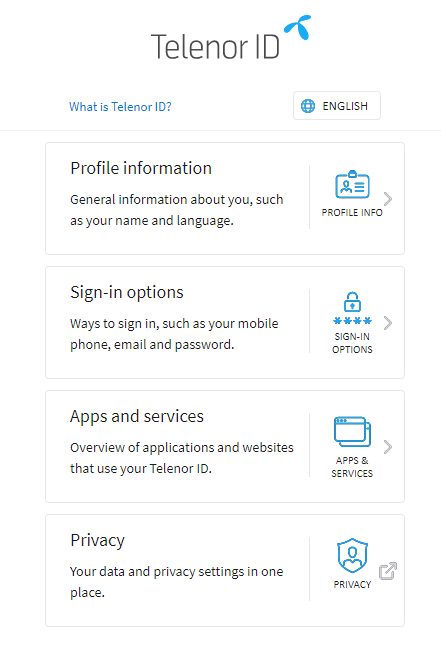
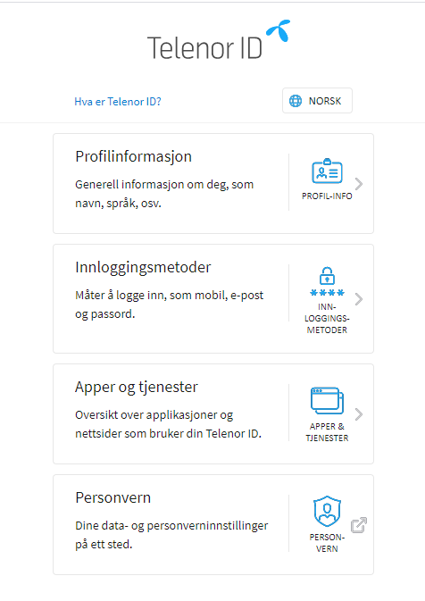

## Manage My Telenor ID+ API

"Manage My Telenor ID" is where end users can administrate their ID account, eg. change password, add a mobile phone number, choose log in method etc.

All sevices with a profile page should link to Manage My TelenorID\+.

For TelenorID\+, we have to check if MSISDN is to be handled according to National Storage before redirecting to appropriate "Manage My TelenorID".

Call to this API will determine the URL that to be used for this logged in user:

## API

 * Production: https://id.telenor.no/api/meta/v1/self-service
 * Test: https://id-test.telenor.no/api/meta/v1/self-service

## INPUT
The service needs to send the access_token to get access:
> {Bearer: ibis\_access\_token} 

You will get a link back to the TelenorID account administration to use.
Add **`?locale=no`**  to the link in the response to get Norwegian language.

---

### How it Looks for National Storage End Users

TBD screen dump

### How it Looks for Regular End Users

Important to remember however is that when linking from native clients the app must open in custom tabs, and also to emphasise the last locale parameter in link to ensure Norwegian language as default.

If the client wants to use the "Endre Telenor ID"- button in their UI, see below for button design and style guide.

#### English

##### Buttons and style guide "Manage Telenor ID" / "Sign in with Telenor ID"

[https://telenordigital.invisionapp.com/share/68UNGRPFX7K#/screens/391468481](https://telenordigital.invisionapp.com/share/68UNGRPFX7K#/screens/391468481)

#### Norwegian

##### Buttons and style guide "Endre Telenor ID" / "Logg inn med Telenor ID"

[https://telenordigital.invisionapp.com/share/68UNGRPFX7K#/screens/416762909](https://telenordigital.invisionapp.com/share/68UNGRPFX7K#/screens/416762909)