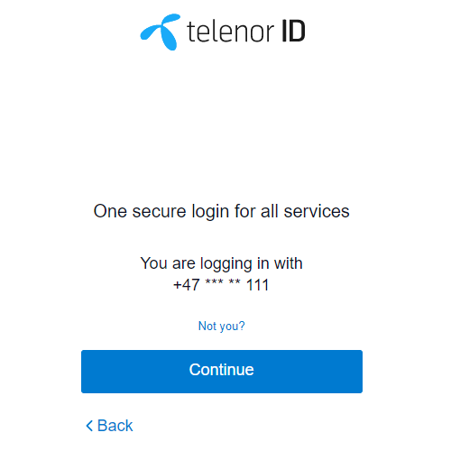

# Seamless Login / SSO

## Single Sign On

[Single sign-on (SSO)](https://en.wikipedia.org/wiki/Single_sign-on) is an authentication scheme that allows a user to log in with a single ID and password to any of several related, yet independent, software systems. The [OIDC](OIDC_basics.md) api provided by Telenor\+ enables SSO for all Telenor services.

In addition to this TelenorID\+ provides several solutions for a more Seamless Single sign-on process where the user can experience a efficient and seamless switch between Telenor services.
In addition to this TelenorID\+ provides Telenor services the possibility to disable the reuse of a establish Single sign-on session if needed.


## TelenorID\+ session cookie

TelenorID\+ stores a [web cookie](https://en.wikipedia.org/wiki/HTTP_cookie) in the end-user browser when the user is authenticated.
This cookie is used to recognize the end-user when a new login request in the same browser is sent and enables a simplified login process.

How long and if the cookie is persisted depends on the usecase:

| Usecase                                                                                       | Cookie expires |                                                    Description                                                    |
|-----------------------------------------------------------------------------------------------|:--------------:|:-----------------------------------------------------------------------------------------------------------------:|
| If TelenorID returns the attribute td_sls=TRUE                                                |    session     |                               This is the default usecase for login to web clients                                |
| TelenorID+ client is a web application and<br>If TelenorID returns the attribute td_sls=FALSE |    14 days     |                                           user chooses to be remembered                                           |
| TelenorID+ client is a MobileApp and<br>If TelenorID returns the attribute td_sls=FALSE       |    90 days     | The cookie is always created for users using a MobileApps. The assumption is that apps is used on private devices |

For more information about TelenorID attribute td_sls: [TelenorID api doc](https://docs.telenordigital.com/connect/id/id_token.html)
When the Cookie expires is set to session, it means that the webbrowser will delete the cookie when the browser is closed.

## One Telenor 

One Telenor is a strategy that shall ensure that the Telenor Norway channels are perceived as coherent.
In TelenorID\+ a client/RP can choose to be part of “One Telenor” or not. A normal client (outside of One Telenor) will generate an isolated TelenorID+ session and have a unique clientID towards Telenor ID (TD).
For the One Telenor clients all clients will share the same TelenorID+ session and have the same ClientID towards TelenorID (TD). 
This will result in a more seamless login experience between the One Telenor clients then the normal clients.

## Silent SSO

[](images/telenorid_default_sso_page.png)
When a user has a valid session cookie and accesses a new Telenor service that requires login with TelenorID\+ the normal feature is that the user is sent via TelenorID (TD) and will be prompted with a page asking the user to continue. (see screenshot)

A TelenorID\+ client can be configured with the attribute ```silentSSO``` to avoid this.
All clients where ```silentSSO``` will avoid this screen and can experience a more seamless SSO towards it's service when users comes from another service. This configuration must be preconfigured on setup.


## Check if user has Session

A client can check if a user has a existing session or not.
This is done with the [API call /autorize](TelenorID_Plus_-_authorize.md) using the parameter ```prompt=none```

## Ignore SSO and force authentication

A client can force the user to autenticate even if a sso sesion exists.
This is done with the [API call /autorize](TelenorID_Plus_-_authorize.md) using the parameter ```prompt=login```
