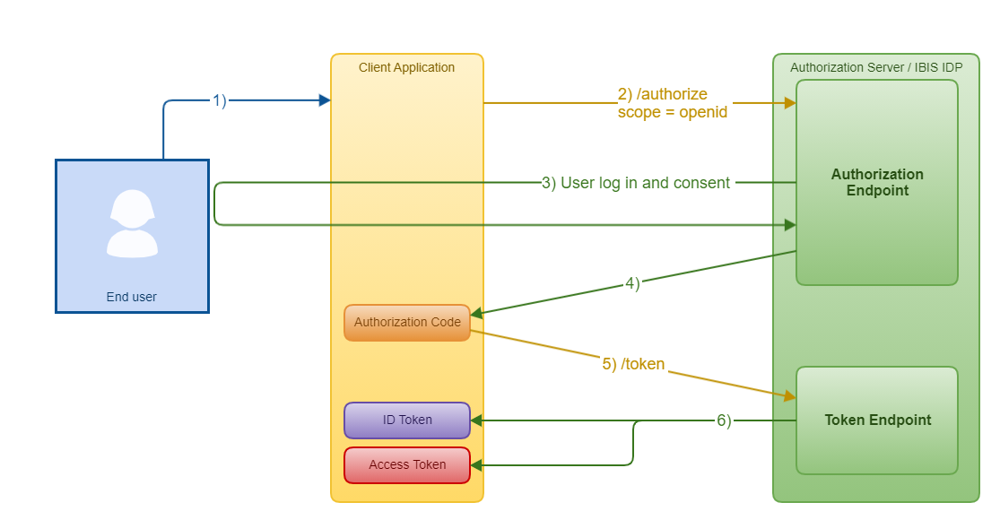
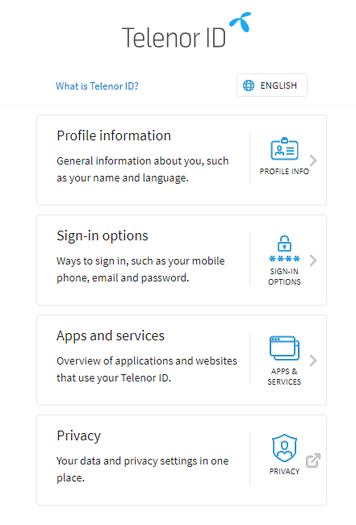
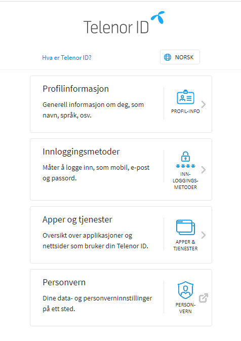

# TelenorID\+ Integration Guide

  * [Get Started With TelenorID\+](#get-started-with-telenorid)
    + [New TelenorID\+ Client with API Access - API Client](#new-telenorid-client-with-api-access---api-client)
    + [New TelenorID\+ Client - IBIS Only (no API Access)](#new-telenorid-client---ibis-only-no-api-access)
    + [Client Type - Confidential vs Public Clients](#client-type---confidential-vs-public-clients)
    + [Scopes](#scopes)
      - [Identity Scopes](#identity-scopes)
      - [API Scopes](#api-scopes)
    + [Language](#language)
    + [Access to SDKs on Telenor Norway GitHub for Native Clients](#access-to-sdks-on-telenor-norway-github-for-native-clients)
    + [IBIS URIs in the Staging and Production Environments](#ibis-uris-in-the-staging-and-production-environments)
    + [Debugger](#debugger)
    + [Help / Questions](#help--questions)
  * [Overview OpenID Connect (OIDC)](#overview-openid-connect-oidc)
    + [Related Articles](#related-articles)
    + [Core Concepts](#core-concepts)
    + [Simplified OpenID Connect Authorization Code Flow](#simplified-openid-connect-authorization-code-flow)
  * [Web Clients](#web-clients)
    + [TelenorID\+ OIDC Authorization Code Flow With ClientID and Secret](#telenorid-oidc-authorization-code-flow-with-clientid-and-secret)
    + [Authentication Using Client ID and Secret](#authentication-using-client-id-and-secret)
    + [JavaScript](#javascript)
      - [Preferred Library](#preferred-library)
      - [Simple Code Example](#simple-code-example)
    + [Java](#java)
      - [Preferred Library](#preferred-library-1)
      - [Simple Code Example](#simple-code-example-1)
    + [.NET](#net)
      - [Preferred Library](#preferred-library-2)
      - [Simple Code Example](#simple-code-example-2)
    + [Example 1 - Step-by-step: Login](#example-1---step-by-step-login)
    + [Example 2 - Step-by-step: Know Your Customer / BankId](#example-2---step-by-step-know-your-customer--bankid)
    + [Seamless Login / SSO](#seamless-login--sso)
    + [Token Refresh](#token-refresh)
      - [Get refresh\_token](#get-refresh_token)
      - [Use refresh\_token](#use-refresh_token)
    + [Logout](#logout)
  * [Native Clients (Android/iOS/..)](#native-clients-androidios)
    + [TelenorID\+ OIDC Authorization Code Flow With PKCE](#telenorid-oidc-authorization-code-flow-with-pkce)
    + [Authentication Using Client ID and PKCE](#authentication-using-client-id-and-pkce)
    + [Android](#android)
    + [iOS](#ios)
  * [Manage My Telenor ID+](#manage-my-telenor-id)
    + [How it Looks for National Storage End Users](#how-it-looks-for-national-storage-end-users)
    + [How it Looks for Regular End Users](#how-it-looks-for-regular-end-users)
      - [English](#english)
        * [Buttons and style guide "Manage Telenor ID" / "Sign in with Telenor ID"](#buttons-and-style-guide-manage-telenor-id--sign-in-with-telenor-id)
      - [Norwegian](#norwegian)
        * [Buttons and style guide "Endre Telenor ID" / "Logg inn med Telenor ID"](#buttons-and-style-guide-endre-telenor-id--logg-inn-med-telenor-id)
  * [Q & A](#q-a)
  


## Get Started With TelenorID\+

**TelenorID\+ offers login through the OpenID Connect (OIDC) protocol. 
This article contains only a basic introduction to the protocol. 
OIDC is a well established industry standard for authentication and authorisation and so material are available;
check the [related articles](#related-articles).**

Functionally the TelenorID\+ solution is almost identical to FellesID.
TelenorID\+ uses the OIDC protocol in addition to OAuth (FellesID).

OIDC is a superset of OAuth so it has some extra features.
Primarly that it is statefull and can keep track of a user's session. 
OIDC also issues an id\_token containing basic information about the user which also can be 
used to verify that a user is logged in.

ClientIDs and Secrets (for Confidential clients) are used to authenticate the client with TelenorID\+
when obtaining tokens etc.
These credentials will be different for the different environments (test / prod), and type of client.

It is very important to use the correct client type for your application due to different security considerations. 
[Single Sign On (SSO)](#seamless-login--sso) and token refresh also differs between the native and web clients.

For example, if you have three applications, one web, one native Android and one native iOS,
you will need to request three TelenorID\+ clients, one for each application. 

### New TelenorID\+ Client with API Access - API Client

If your service needs access to any of the Telenor APIs on APIgee, you will need to request a TelenorID\+ client with API access.

*   If your service is new to TelenorID\+, check out [TelenorID\+ Onboarding of New Services](#TelenorID\+OnboardingNewClients-TelenorID\+OnboardingofNewServices).
*   If you are already familiar with the Developer Portal, and your service is already using TelenorID\+, check out [Additional TelenorID\+ Client with API Access - API Client](#TelenorID\+OnboardingNewClients-AdditionalTelenorID\+ClientwithAPIAccess-APIClient).

### New TelenorID\+ Client - IBIS Only (no API Access)

If your service only require plain login (and do not need API access on Apigee), you can request a TelenorID\+ client without API access, a IBIS client.

*   f your service is new to TelenorID\+, check out [TelenorID\+ Onboarding of New Services](#TelenorID\+OnboardingNewClients-TelenorID\+OnboardingofNewServices).
*   If you are already familiar with the Developer Portal, and your service is already using TelenorID\+, check out [Additional TelenorID\+ Client - IBIS Only (no API Access)](#TelenorID\+OnboardingNewClients-AdditionalTelenorID\+Client-IBISOnly(noAPIAccess)).

### Client Type - Confidential vs Public Clients

| Client Type   | Description   | Pros & Cons |
| ------------- | ------------- | ------------|
| Confidential  | Any client that will run in a secure environment and will store the client credentials in a secure way; | Benefits - can typically access all scopes. |
|               | typically only servers. Examples are traditional back-ends or back-end for front-ends (BFFs) | Can request refresh\_tokens ("offline access") |
| Public        | Traditional SPAs, Native (desktop or mobile) apps | Drawbacks: Can not get a refresh\_token |
|               |              | Session refresh must be done through "silent refresh" |

### Scopes

There are two different types of scopes. "Identity scopes" and "API Scopes".

#### Identity Scopes

_**The most commonly used scopes and which claims they return.**_

Each scope returns a set of user attributes which are called claims. The scopes an application should request depend on which user attributes the application needs.  
Claims are returned either directly in the id\_token or can be fetched via the /userinfo endpoint.  

| Scope             | Where         | Description/Returned Claims   |
| ----------------- | ------------- | ----------------------------- |
| openid            |  /token       | To indicate that the application intends to use OIDC to verify the user's identity Returns the **sub** claim which uniquely identifies the end user. Returns an ID Token in addition to the Access Token |   
| ial2              |               | Identity Assurance Level 2    |
| profile           | /userinfo     | name (given\_name, middle\_name, family\_name), birthdate, kurtid |
| email             | /userinfo     | email address                 |
| phone             | /userinfo     | phone number                  |
| tnn.ids           | access\_token | kurtid, tnuid                 |
| offline\_access   |               | to get a refresh token        |

#### API Scopes

Each client must explicitly request the scopes they need.

API scopes (scopes for access to Telenor APIs on Apigee) will not be visible on well-known 
as they are located and managed on the Apigee / Developer portal.  
IBIS will take all the scopes that start with "api:" and send them to Apigee for lookup. 
In practice, a client is stored at both IBIS and Apigee, but we make sure to keep it in sync.

Existing api:<apigee\_service> scopes will not change and will remain the same as used today.

[API-EXP-SCOPES](https://prima.corp.telenor.no/confluence/display/DC/API-EXP-SCOPES)

### Language

Use **_ui\_locales=no_** to choose Norwegian language.

### Access to SDKs on Telenor Norway GitHub for Native Clients

If you have native clients and want to use our SDK for Android and/or iOS,
you need to request access to the Telenor Norway repository (if not already member of TelenorNorway).

Send the github account that require access to **dc\_security@telenor.com**, 
or request access on Slack [#dc-telenorid-integration-support](https://thedoozers.slack.com/archives/C01DHF39NDA).

### IBIS URIs in the Staging and Production Environments

We URIs have been changed/are about to change, see [TelenorID\+ Switch to new domain id.telenor.no](TelenorID_Plus_-_switch_to_new_domain.md) for more information.

| Endpoint                  | STAGING                                       | PRODUCTION                                |
| ------------------------- | --------------------------------------------- | ----------------------------------------- |
|                           | https://id-test.telenor.no/.well-known/openid-configuration | https://id.telenor.no/.well-known/openid-configuration |
| Authorization endpoint    | https://id-test.telenor.no/connect/authorize  | https://id.telenor.no/connect/authorize   |
| Token endpoint            | https://id-test.telenor.no/connect/token      | https://id.telenor.no/connect/token       |
| Userinfo endpoint         | https://id-test.telenor.no/connect/userinfo   | https://id.telenor.no/connect/userinfo    |
| Check session endpoint    | https://id-test.telenor.no/connect/checksession | https://id.telenor.no/connect/checksession |
| Logout endpoint           | https://id-test.telenor.no/connect/endsession | https://id.telenor.no/connect/endsession  |

### Debugger

The debugger is a useful tool to validate that your client is correctly configured and has access to the scopes you accept.  
All public clients (i.e. "PKCE clients") are configured to work with the debugger.

[https://oidc-test.telenor.no/](https://oidc-test.telenor.no/)

### Help / Questions

| Integration Support       |
| ------------------------- |
| TelenorID integration questions or request for help can be posted on Slack in [#dc-telenorid-integration-support](https://thedoozers.slack.com/archives/C01DHF39NDA) |


| Incidents or Problems in Production      |
| ---------------------------------------- |
| For reporting incidents or problems with TelenorID in production , use the Slack channel [#dc-telenorid-production-support](https://thedoozers.slack.com/archives/C01TK0NV8KW) |

## Overview OpenID Connect (OIDC)

### Related Articles

* [OpenID Specifications](https://openid.net/developers/specs/)
* [Creating a Shared Secret](https://docs.identityserver.io/en/release/topics/secrets.html)
* [Implicit Flow vs. Code Flow with PKCE](https://christianlydemann.com/implicit-flow-vs-code-flow-with-pkce/)
* [OpenID Connect vs OAuth vs SAML 2](https://www.hackedu.com/blog/analysis-of-common-federated-identity-protocols-openid-connect-vs-oauth-2.0-vs-saml-2.0)
* [OpenID Connect Protocol](https://auth0.com/docs/protocols/openid-connect-protocol)
    + [Single Sign-On](https://auth0.com/docs/sso)
    + [Tokens](https://auth0.com/docs/tokens)
    + [Refresh Tokens](https://auth0.com/docs/tokens/refresh-tokens)
* [Authorize Endpoint](https://identityserver4.readthedocs.io/en/latest/endpoints/authorize.html)
* [Token Endpoint](https://identityserver4.readthedocs.io/en/latest/endpoints/token.html)
* [UserInfo Endpoint](https://identityserver4.readthedocs.io/en/latest/endpoints/userinfo.html)
* [End Session Endpoint - Logout](https://identityserver4.readthedocs.io/en/latest/endpoints/endsession.html#refendsession)
* [Free intro training for OAuth 2.0 and OpenID Connect](https://courses.pragmaticwebsecurity.com/courses/take/introduction-to-oauth-2-0-and-openid-connect)

### Core Concepts

OIDC is a superset of the Oauth protocol. If you've used OAuth (e.g via Apigee), OIDC should be very familiar.

|                           |                      |
| ------------------------- | -------------------- |
| Resource Owner/End User   | The User that has access to the resource and the entity capable of granting access to the protected resource |
| Client                    | An application making protected resources request on behalf of the resource owner/end user and with the resource owner's authorization |
|                           | The application that needs access to the protected resource |
| Authorisation Server (AS) / Identity Provider (IDP)  | The system whom you delegate your applications trust to provide authentication- and authorisation information about an end user or system. For Telenor Norway this system is "IBIS". IBIS is a federated gateway and delegates authentication of end users to other Identity Providers (e.g. Telenor Digital's "Connect"). |
| id\_token                 | A JSON web token (JWT) containing claims about the end user who logged in, typically their name and address. What claims are available in the id\_token is dependent on which scopes are requested by your client. |
|                           | _**Note**_: Unlike the access\_token, the id\_token shall not be sent as a proof of authentication. The id\_token is solely designed to be consumed (used) on the receiving client (the token contains an "issued to" claim which must be validated; "is this token issued to me?") - do **not** use ID tokens to gain access to an API |
| access\_token             | The token used for authorisation purposes, e.g. "can this client access this API?". The access\_tokens issued by IBIS can also contain identifiers for the current end user, e.g "KurtId" and/or "TnuId". |
|                           | The access token has short expiration time and will have to be refreshed frequently: The OAuth protocol does not contain the concept of "log out", instead it relies on all sessions being short lived. When a end user wants to log out we simply stop to refresh the access token. |
| refresh\_token            | As the name implies this token is used to refresh (prolong) the end user's session. The refresh\_token is exchanged at the auth. server which will issue a new access and refresh\_token. Note that a refresh will fail if the end user has terminated their session (logged out). |
| Flows                     | While the oauth protocol originally contained numerous flows. All but two are now considered insecure and not recommended. The two remaining flows are "authorisation code with PKCE" and "authorisation code with client secret". |
|                           | The PKCE (Proof-key for Code-Exchange) flow is the default and recommended for all **public** clients. A PKCE allows the Authorisation server to validate that client who receives tokens is the same client that requested them (i.e solving the problem of authorisation code request being vulnerable to hijacks). |
|                           | Client secrets are only permitted for clients who will run on back-end servers. These clients typically need to access broader scopes than those running on clients (front-end / mobile apps). This is the recommended flow for **confidential** web clients (with BFFs) |

### Simplified OpenID Connect Authorization Code Flow



## Web Clients

### TelenorID\+ OIDC Authorization Code Flow With ClientID and Secret


[Standard OIDC Authorization Code Flow](TelenorID_Plus_-_standard_oidc_flows.md#standard-oidc-authorization-code-flow) for reference.

### Authentication Using Client ID and Secret

|                           |
| ------------------------- |
| **Do NOT store the client id and secret unencrypted in git. Never pass the client secret as a URL parameter.** |

[Creating a Shared Secret](https://docs.identityserver.io/en/release/topics/secrets.html)

You can either send the client id/secret combination as part of the POST body:

| POST Body                           |
| ----------------------------------- |
| POST /connect/token <br/> client\_id=client1& <br/> client\_secret=secret& <br/> ... |

..or as a basic authentication header:

| Basic Authentication Header         | 
| ----------------------------------- | 
| POST /connect/token<br/> Authorization: Basic xxxxx<br/> ... |

You can manually create a basic authentication header using the following C# code:

| C# Code                             | 
| ----------------------------------- | 
| var credentials = string.Format("{0}:{1}", clientId, clientSecret);<br/>var headerValue = Convert.ToBase64String(Encoding.UTF8.GetBytes(credentials));<br/>var client = new HttpClient();<br/>client.DefaultRequestHeaders.Authorization = new AuthenticationHeaderValue("Basic", headerValue); | 

The [IdentityModel](https://urldefense.proofpoint.com/v2/url?u=https-3A__github.com_IdentityModel_IdentityModel&d=DwMGaQ&c=eIGjsITfXP_y-DLLX0uEHXJvU8nOHrUK8IrwNKOtkVU&r=PmUJdtih5o42k0kXOdnC3jHg07jxhDU5Y1DQXG7amQQIL8kqZzyCGCvUnwsv5IzY&m=sp-JS3m0rgBIy_zWGHRgIoOeUv4dBIgtPeosEPdS9js&s=SUp79QWcBy2CIMSl8O5qhqEm94wbJSgh0oRmFbeXnZo&e=) library has helper classes called **TokenClient** and **IntrospectionClient** that encapsulate both authentication and protocol messages. 

|                              | 
| ---------------------------- | 
| We **strongly encourage** the use of libraries for the integration. <br/> This will simplify the integration, help avoid common pitfalls/bugs, and ease upgrading to newer versions of the protocol.| 
| You can find libraries for Java, .NET, JavaScript, TypeScript, PHP, Python, and even Erlang here: [https://openid.net/developers/certified/](https://openid.net/developers/certified/) |

### JavaScript

#### Preferred Library

[https://github.com/IdentityModel/oidc-client-js](https://github.com/IdentityModel/oidc-client-js)

#### Simple Code Example

Using the client library
*   Browser client: [https://github.com/IdentityModel/oidc-client-js](https://github.com/IdentityModel/oidc-client-js)

or  

*   node.js backend: [https://github.com/panva/node-openid-client](https://github.com/panva/node-openid-client)

Showing a simple client login and callback:

**[DCSEC / telenor-idpluss-integration-examples / JavaScript / node-openid-client.js](https://prima.corp.telenor.no/bitbucket/projects/DCSEC/repos/telenor-idpluss-integration-examples/browse/JavaScript/node-openid-client.js?at=refs/heads/master)**

```javascript
const { Issuer } = require('openid-client');
const express = require('express');
const session = require('express-session')
const configloader = require('tn-dchub-encryptedconfig');

const config = configloader.loadJsonConfigSync('config/config.json', '/secrets/master-key');

const app = new express();

app.set('trust proxy', true);

app.use(session({
    secret: config.sessionSecret,
    resave: false,
    saveUninitialized: true,
    cookie: { secure: config.secureCookie }
}));

var client = null;

Issuer.discover('https://idp.telenorid-staging.com') // => Promise
    .then(issuer => {
        client = new issuer.Client({
            client_id: config.client_id,
            client_secret: config.client_secret,
            redirect_uris: [`${config.host}${config.callbackUrl}`],
            response_types: ['code']
        });
        app.listen(config.port, () => {
            console.log("It's configured. Listening on " + config.port);
        });
    });

app.get('/authorize', (req, res) => {
    let url = client.authorizationUrl({
        scope: config.scopes.join(' '),
        redirect_uri: `${config.host}${config.callbackUrl}`
    });
    res.setHeader('Location', url);
    res.status(302)
    res.end();
});

app.get(config.callbackUrl, (req, res) => {
    const params = client.callbackParams(req);
    client.callback(`${config.host}${config.callbackUrl}`, params) // => Promise
        .then(function (tokenSet) {
            req.session["access_token"] = tokenSet.access_token;
            req.session.save(() => {
                res.status(302);
                res.setHeader('Location', '/');
                res.end();
            });
        });
});

app.get('/userinfo', (req, res) => {
    let access_token = req.session["access_token"];
    if (!access_token) {
        res.status(401)
        return res.end("You are not logged in.");
    }

    client.userinfo(access_token) // => Promise
        .then(function (userinfo) {
            console.log(userinfo);
            res.end(JSON.stringify(userinfo));
        });
});

app.get('/', (req, res) => {
    res.setHeader('Content-Type', 'text/html');
    res.end(`   
        <p>Hello world <a href="/authorize">login</a></p>
        <div id="hola"></div>
        <script>
        fetch('/userinfo')
            .then(d => d.json())
            .then(d => document.getElementById('hola').innerText = JSON.stringify(d))
        </script>
    `);
});
```

### Java

#### Preferred Library

We will develop our own library. If you cannot wait, use one of the Java-libraries here: [https://openid.net/developers/certified/](https://openid.net/developers/certified/)

#### Simple Code Example

Showing a simple client login and callback:

**[DCSEC / telenor-idpluss-integration-examples / Java / SpringBoot.java](https://prima.corp.telenor.no/bitbucket/projects/DCSEC/repos/telenor-idpluss-integration-examples/browse/Java/SpringBoot.java?at=refs/heads/master)**

```java
import dchub.feature.encryptedproperties.EncryptedPropertiesInitializer;
import org.springframework.beans.factory.annotation.Value;
import org.springframework.boot.SpringApplication;
import org.springframework.boot.autoconfigure.SpringBootApplication;
import org.springframework.security.config.annotation.web.builders.HttpSecurity;
import org.springframework.security.config.annotation.web.configuration.WebSecurityConfigurerAdapter;
import org.springframework.security.oauth2.client.registration.ClientRegistrations;
import org.springframework.security.oauth2.client.registration.InMemoryClientRegistrationRepository;
import org.springframework.security.oauth2.core.AuthorizationGrantType;

@SpringBootApplication
public class Application extends WebSecurityConfigurerAdapter {

    @Value("${oidc.issuer}")
    private String issuer;
    @Value("${oidc.clientId}")
    private String clientId;
    @Value("${oidc.clientSecret}")
    private String clientSecret;
    @Value("${oidc.scopes}")
    private String scopes;
    @Value("${oidc.redirectPath}")
    private String redirectPath;
    @Value("${oidc.authorizationPath}")
    private String authorizationPath;
    @Value("${oidc.loginPath}")
    private String loginPath;


    public static void main(String[] args) {

        SpringApplication application = new SpringApplication(Application.class);

        application.addInitializers(new EncryptedPropertiesInitializer());
        application.run(args);
    }

    @Override
    protected void configure(HttpSecurity http) throws Exception {
        var oidcScopes = scopes.split(",");

        var reg = new InMemoryClientRegistrationRepository(
                ClientRegistrations
                        .fromOidcIssuerLocation(issuer)
                        .clientId(clientId)
                        .clientSecret(clientSecret)
                        .scope(oidcScopes)
                        .redirectUriTemplate("{baseUrl}" + redirectPath)
                        .authorizationGrantType(AuthorizationGrantType.AUTHORIZATION_CODE)
                        .build()
        );

        http
                .oauth2Login(oauthclient -> {
                       oauthclient.clientRegistrationRepository(reg);
                       oauthclient.authorizationEndpoint(c -> c.baseUri(authorizationPath));
                       oauthclient.redirectionEndpoint(r ->
                          r.baseUri(redirectPath)
                       );
                       //oauthclient.loginPage(loginPath);
                })
                .authorizeRequests(a -> a
                    .antMatchers("/", "/error").permitAll()
                    .anyRequest().authenticated()
                )
                .logout(l -> l
                        .logoutSuccessUrl("/").permitAll()
                );
    }

}
```

### .NET

#### Preferred Library

[https://identitymodel.readthedocs.io/en/latest/](https://identitymodel.readthedocs.io/en/latest/)

#### Simple Code Example

Coming...

### Example 1 - Step-by-step: Login

The following example will walk through the common use case for logging in with IBIS. The examples show raw HTTP requests generated using the public debugger (available here: [https://oidc-test.telenor.no/](https://oidc-test.telenor.no/)) and a public demo-client.  
**Thus this example uses a OpenID Connect Flow with PKCE even though most web clients will be confidential and should use the OpenID Connect Authorization Flow with client id and secret handled in a backend.**

The debugger utilises the **[oidc-client-js](https://github.com/IdentityModel/oidc-client-js)** client. As can be seen by the parameters in the example there are several parameters which must be securely generated and later validated; we once again stress that you should not try to "hand craft" oauth / oidc requests.

[End User Login](TelenorID_Plus_-_user_login_-_integration_example_step_by_step.md)

### Example 2 - Step-by-step: Know Your Customer / BankId
 
The following example is the use case for performing identity verification in with IBIS using BankID. Bank ID cannot be used for logging in, and should only be used for specific use cases that require verifying the identity of a new or existing customer/end user. The examples show raw HTTP requests generated using the public debugger.

The debugger is a useful tool to validate that your (public) client is correctly configured and has access to the scopes you accept.  
All public clients (i.e. "PKCE clients") are configured to work with the debugger.

The debugger utilises the **[oidc-client-js](https://github.com/IdentityModel/oidc-client-js)** client. As can be seen by the parameters below there are several parameters which must be securely generated and later validated; we once again stress that you should not try to "hand craft" oauth / oidc requests.

[Know Your Customer (KYC) / BankId](TelenorID_Plus_-_kyc_bankid_-_integration_example_step_by_step.md)

### Seamless Login / SSO

Single Sign-on (SSO) occurs when a user logs in to one application and is then signed in to other applications automatically, regardless of the platform, technology, or domain the user is using. SSO provides a seamless experience for users when using your applications and services.

The OIDC protocol supports a _**prompt=none**_ parameter on the /authorize request that allows applications to indicate that the authorization server (here: IBIS) must not display any user interaction - silent authentication.  
IBIS will either return the requested response back to the application (access\_token), or return an error if the user is not already authenticated or if some type of consent or prompt is required before proceeding.  
If the user was already logged in, IBIS will respond exactly as if the user had authenticated manually through the login page.  

Be aware that some client libraries will automatically have a "fallback" to normal login, but this can largely be overridden.

If the user was not logged in via Single Sign-on (SSO) or their SSO session had expired, IBIS will redirect to the specified redirect\_uri (callback URL) with an error:

*   login\_required - The user was not logged in at IBIS, so silent authentication is not possible. IBIS requires end user authentication.

If an error are returned, an /authorize request without prompt=none parameter must be sent for the end user to be redirected to the login page.

### Token Refresh

Refresh tokens are typically longer-lived and can be used to request new access tokens after the shorter-lived access tokens expire. Refresh tokens are often used in native applications on mobile devices in conjunction with short-lived access tokens to provide seamless UX without having to issue long-lived access tokens.

The refresh token is stored in session. Then, when a session needs to be refreshed (for example, a preconfigured timeframe has passed or the user tries to perform a sensitive operation), the client uses the refresh token on the backend to obtain a new set of tokens, using the /token endpoint with _grant\_type=refresh\_token_.

#### Get refresh\_token

To get a refresh token, you must include the _**offline\_access**_ scope when you initiate an authentication request through the /authorize endpoint.

Once the user authenticates successfully, the application will be redirected to the redirect\_uri, with an authorization code . You can exchange this code with an access token using the /token endpoint.

The response should contain an access token, id token and a refresh token.


#### Use refresh\_token

You should only ask for a new token if the access\_token has expired or you want to refresh the claims contained in the id\_token.  
For example, it's bad practice to call the endpoint to get a new access\_token every time you call an API. 

To exchange the refresh\_token you received during authorization for a new access\_token, make a POST request to the /token endpoint using _**grant\_type=refresh\_token**_


### Logout

 * [Read about the TelenorID\+ Logout flow](TelenorID_Plus_-_logout.html)

## Native Clients (Android/iOS/..)

### TelenorID\+ OIDC Authorization Code Flow With PKCE


[Standard OIDC Authorization Code Flow (PKCE)](TelenorID_Plus_-_standard_oidc_flows.md#standard-oidc-authorization-code-flow-pkce) for reference.

|                              | 
| ---------------------------- |
| We **strongly encourage** the use of our SDKs for the integration. |
| This will simplify the integration, help avoid common pitfalls/bugs, and ease upgrading to newer versions of the protocol. | 
| When using our SDKs you will also automatically get **line authentication** when on a cellular network. |
| More information on our SDKs for both Android and iOS can be found here: [TelenorID\+ integration using SDK](TelenorID_Plus_-_telenorid_from_sdk.md) |


*   A native app must not wrap a login flow implemented in a web application. This violates security requirements since it offers login in an unidentified window (without displaying the domain of the authorization server in a browser).  
    The proof of authorization, which for OAuth is the auhorization code, should be delivered directly to the app code, not via some web application. Use Android App Links or Apple Universal Links to do this in the most secure way.
*   To increase the likelihood of getting SSO, the default browser must be used, rather than forcing usage of a specific browser like Chrome. Also, you should use custom tabs for the authentication flow to get a smoother integration.
*   A client is must maintain a session towards the authorization server using tokens and must notice when it has lost authorization (the tokens have become invalid). This can easily be tested by removing access for the client in the Telenor Digital end user self-service solution at [https://connect.telenordigital.com/gui/mypage/manageclientauthorizations](https://connect.telenordigital.com/gui/mypage/manageclientauthorizations), and checking whether the client is considering the end user logged out.

### Authentication Using Client ID and PKCE

Before the /authorization request, the client app will generate the **code\_verifier**, a cryptographically random string using the characters A-Z, a-z, 0-9, and the punctuation characters -.\_~ (hyphen, period, underscore, and tilde), between 43 and 128 characters long.

The **code\_verifier** is then used to generate the **code\_challenge**. The code\_challenge is a BASE64 URL encoded string of the SHA256 hash of the **code\_verifier**.

The **code\_challenge** and the **code\_challenge\_method** are sent on the /authorization request along other parameters. The **code\_verifier** is sent on the /token request so the authorization server can verify that the client requesting the tokens are the same that did the /authorization request.

### Android

Read [Handling Android App Links](https://developer.android.com/training/app-links), and especially [Verify Android App Links](https://developer.android.com/training/app-links/verify-site-associations)

**[TelenorID Plus Android SDK](https://github.com/TelenorNorway/telenorid-sdk-android)**

You configure the SDK with your client credentials and for which environment they are configured, either staging or production.

You need to [request access](#access-to-sdks-on-telenor-norway-github-for-native-clients) to the GitHub Repository if not already a member of TelenorNorway.

More information: [TelenorID SDK - Android](TelenorID_Plus_-_telenorid_from_sdk.md#telenorid-sdk---android)

### iOS

Article on [Universal links for Android and iOS](https://medium.com/bumble-tech/universal-links-for-android-and-ios-1ddb1e70cab0)

[Adding support for universal link on iOS](https://developer.apple.com/library/archive/documentation/General/Conceptual/AppSearch/UniversalLinks.html) (apple.com)

**[TelenorID Plus iOS SDK](https://github.com/TelenorNorway/telenorid-sdk-ios)**

You configure the SDK with your client credentials and for which environment they are configured, either staging or production.

You need to [request access](#access-to-sdks-on-telenor-norway-github-for-native-clients) to the GitHub Repository if not already a member of TelenorNorway.

More information: [TelenorID SDK - iOS](TelenorID_Plus_-_telenorid_from_sdk.md#telenorid-sdk---ios)

## Manage My Telenor ID+

"Manage My Telenor ID" is where end users can administrate their ID account, eg. change password, add a mobile phone number, choose log in method etc.

All sevices with a profile page should link to Manage My TelenorID\+.

For TelenorID\+, we have to check if MSISDN is to be handled according to National Storage before redirecting to appropriate "Manage My TelenorID".

Call to this API will determine if you should be handled according to National Storage or not:

Manage My TelenorID Pluss

**id-test.telenor.no/api/meta/v1/self-service**  
{Bearer: ibis\_access\_token} 

You will get a link back to the TelenorID account administration to use.
Add **`?locale=no`**  to the link in the response to get Norwegian language.

### How it Looks for National Storage End Users

TBD screen dump

### How it Looks for Regular End Users

Important to remember however is that when linking from native clients the app must open in custom tabs, and also to emphasise the last locale parameter in link to ensure Norwegian language as default.

If the client wants to use the "Endre Telenor ID"- button in their UI, see below for button design and style guide.

#### English



##### Buttons and style guide "Manage Telenor ID" / "Sign in with Telenor ID"

[https://telenordigital.invisionapp.com/share/68UNGRPFX7K#/screens/391468481](https://telenordigital.invisionapp.com/share/68UNGRPFX7K#/screens/391468481)

#### Norwegian



##### Buttons and style guide "Endre Telenor ID" / "Logg inn med Telenor ID"

[https://telenordigital.invisionapp.com/share/68UNGRPFX7K#/screens/416762909](https://telenordigital.invisionapp.com/share/68UNGRPFX7K#/screens/416762909)

## Q & A

1.  Does it mean that you also implement support for line authentication when using Telenor ID+ for apps, if you follow the advice on "We strongly encourage the use of our SDKs for integration"?
    1.  Yes. If you want line authentication, you must use the SDK.
2.  We currently have a Web app (MBN) with a backend (Talos) whose only task is to handle the client secret for the app. Is it then recommended when switching to Telenor ID to switch to "authorization code with PKCE" and skip the backend?
    1.  We recommend keeping the backend and using "[Authorization Code Flow With ClientID and Secret](https://prima.corp.telenor.no/confluence/pages/viewpage.action?pageId=61425370#TelenorIDPlusIntegrationGuide-TelenorIDPlusOIDCAuthorizationCodeFlowWithClientIDandSecret)" and a confidential web client.
3.  The Telenor Chat application currently runs i.a. in my telenor and on [telenor.no](http://telenor.no). Can we log the customer into the chat client without page refresh when the customer is already on one of these services and is logged in?
    1.  Yes, it should be possible by adding the parameter "prompt=none" i /authorize call.  
        Please note that some client libraries will automatically have a "fallback" to normal login, but this can largely be overridden (see [Seamless Login / SSO](#seamless-login--sso))
4.  At [https://id-test.telenor.no/.well-known/openid-configuration](https://id-test.telenor.no/.well-known/openid-configuration) the following scopes are supported: "scopes\_supported":\["ial3","ial2","ial1","profile","openid","email","phone","tnn.legacy","saml","tnn.ids","tnn.profile.attributes","offline\_access"\]  
    
    How will this be regarding scopes against Apigee? Will one scope per client be created (eg tnn.smartansatt) that has all the scopes this client has access to? Or will each auth flow have to ask for scopes for the different services to be used?  
    1.  Each client must explicitly request the scopes it needs in each /authorize call. If you gradually see that there are very many, it is up to the developer / designer of api to create "scope collections", eg "invoice.read, invoice.write, invoice.delete" may quickly have to be collected as "invoice". (see [Scopes](https://prima.corp.telenor.no/confluence/pages/viewpage.action?pageId=61425370#TelenorIDPlusIntegrationGuide-Scopes))  
        API scopes (scopes for Apigee) will not be visible on IBIS well-known as they are located and managed on the Apigee / developer portal. This works by IBIS taking all scopes starting with "api:" and sending them to Apigee for lookup. In practice, a client is stored at both IBIS and Apigee, but we make sure to keep it in sync. Existing _**api:<apigee\_service>**_ scopes will not change and for example these will still be valid:  
        **_api:mobile-product-v2_**  
        **_api:mobile-subscription-v1_**
5.  The "integration guide" states the following for public clients: _Drawbacks: Can not get a refresh\_token_ _Session refresh must be done through "silent refresh".  
    _Does "silent refresh" mean that you should use /authorize with "prompt = none"?
    1.  Correct, but typically you do it in an iframe that is transparent to the user (hence the name, "silent refresh")
6.  Can you get TelenorID\+ without being a Telenor customer?
    1.  Yes
7.  Is "logout URI" mandatory in the client definition on IBIS for iOS and Android apps? (It says in the form that it is "mandatory" regardless of client type)
    1.  It will not be a very beautiful end user experience if it is not provided. Then we can only show the user a white page with the text "You are now logged out".
8.  _to be continued..._
