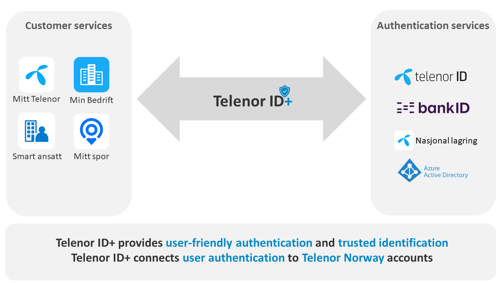
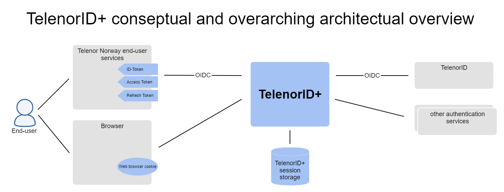

# TelenorID\+ introduction

## Main objectives for TelenorID\+

* TelenorID+ is a hub between all Telenor Norway end-users services and the different authentication services in use.
* TelenorID+ enriches the authentication with data about the users Telenor Norway account.
* TelenorID+ keeps track of all user sessions, and authorization tokens provided to the different end-user services. 
* TelenorID+ simplifies the authentication process by providing single sign on between services

## TelenorID\+ and TelenorID
[TelenorID](https://docs.telenordigital.com/connect/) is the main authentication provider used by TelenorID\+ (but not the only one). TelenorID is a service provided by [Telenor Digital](https://www.telenordigital.com/).
TelenorID\+ is only a name for a collection of technical microservices and not branded or visible for end-users, the brandname for authentication is TelenorID.

## TelenorID\+ overarching architecture

TelenorID\+ is a [OpenID Connect provider (OIDC)](OIDC_basics.md) providing Telenor Norway services with ID and Access Tokens. End-user [single sign on](TelenorID_Plus_-_SSO.md) is implemented with a web browser cookie managed by  TelenorID\+.  TelenorID\+ keeps track of all sessions and tokens in a centralized session storage. TelenorID\+ integates toward several authentication provider, where [TelenorID](https://docs.telenordigital.com/connect/) is the most important and most used provider. TelenorID and TelenorID\+ is tightly integrated to keep track of sessions between the two services.

## Identity assurance levels (IAL)
In TelenorID\+ we recognise three distinct identity assurance levels (IAL) as defined in the standard [NIST SP 800-63-3 Digital Identity Guidelines](https://pages.nist.gov/800-63-3/):

| Level |                                                                                                         Description                                                                                                         |              Examples               |
|:-----:|:-------------------------------:|:-----------------------------------:|
| IAL1  | A self asserted identity with no effort made to ensure that the identity is real.                                                                      | Telenor ID, Facebook, Apple, Google |
| IAL2  |  It has been established that the asserted identity is in fact a real identity, and some effort has been made to ensure that the identity belongs to the entity claiming it.                         |            Telenor ID\+.            |
| IAL3  | It has been established that the asserted identity is in fact a real identity. Documentation proving the relationship between the identity and the entity claiming it has been provided and verified by a competent entity. |              BankID.               |

The IALs can be required as scopes from TelenorID\+ if your service needs to know. In principle an IAL0 also exists for so-called "non personal users" or "service phones." This is an IAL suitable to perform actions anyone with access to the handset should be able to, regardless of who that person is, and that handset is not dedicated to any specific user.

By having the right IAL for a given service, we can make first-time sign-up as easy or hard as it needs to be. Signing up to an IAL1-service would be very simple and non-intrusive, whereas signing up to an IAL3 service will require a lot more effort from the end-user. IAL2 is a compromise for services that require some certainty as to the identity of the end users, such as Mitt Telenor.

The client should request the lowest IAL it can work with. TelenorID\+ will always return the highest IAL in the ID-token and at the /userinfo endpoint in the ial-claim. Based on this one can make authorization decisions as to what features or actions should be available to the user.

## Authentication assurance (AAL)

Like identity assurance, TelenorID\+ recognises three distinct levels of authentication assurance (AAL) as defined in the standard [NIST SP 800-63-3 Digital Identity Guidelines](https://pages.nist.gov/800-63-3/):

| Level |                                                               Description                                                                | Examples |
|:-----:|:----------------------------------------------------------------------------------------------------------------------------------------:|:--------:|
| AAL1  |                  A single authentication factor, such as password, OTP or line authentication (aka. header enrichment).                  |          |
| AAL2  | two independent authentication factors, eg. "something you know" like a password, and "something you have" such as an OTP or a password. |          |
| AAL3  |      an authenticator cryptographically linked to the account, such as a Bank ID dongle or SIM-card or a FIDO authenticator device.      |          |

Note that in [OIDC](OIDC_basics.md) or OAuth nomenclature, an AAL is typically expressed as an Authentication Context Reference (ACR).

By selecting the right AAL for a given service, we can make logging on as easy or as hard as it needs to be. Logging into an AAL1-service will be very simple and non-intrusive, while logging into an AAL3 service will require some effort from the end-user. AAL2 offers a good compromise between security and convenience for services that do not protect high value assets for the user.

## eIDAS Levels of Assurance (LoA)
Under the [eIDAS Regulation (EU)](http://eur-lex.europa.eu/legal-content/EN/TXT/?uri=uriserv%3AOJ.L_.2014.257.01.0073.01.ENG) [910/2014](https://eur-lex.europa.eu/legal-content/EN/TXT/?uri=uriserv%3AOJ.L_.2014.257.01.0073.01.ENG), electronic identification (eID) schemes are classified according to three levels of assurance. 

|    Level    |                                                                                          Description                                                                                           |
|:-----------:|:----------------------------------------------------------------------------------------------------------------------------------------------------------------------------------------------:|
|     Low     |                                           for instance, enrolment is performed by self-registration in a web-page, without any identity verification                                           |
| Substantial | for instance, enrolment is performed by providing and verifying identity information, and authentication by using a user name and a password and a one-time password sent to your mobile phone |
|    High     |                         for instance, enrolment is performed by registering in person in an office, and authentication by using a smartcard, like a National ID Card.                          |

This law is regulated through the Norwegian law [lov om elektroniske tillitstjenester LOV-2018-06-15-44](https://lovdata.no/dokument/LTI/lov/2018-06-15-44) and is assumed required for Telenor in a updated ekom law in the future: [Høring - Forslag til ny ekomlov](https://www.regjeringen.no/no/dokumenter/horing-forslag-til-ny-ekomlov-ny-ekomforskrift-og-endringer-i-nummerforskriften/id2864853/)

## Mapping between IAL, AAL, eidas LoA

| IAL  | AAL  |  eIDAS LoA  |
|:----:|:----:|:-----------:|
| IAL1 | AAL1 |     Low     |
| IAL2 | AAL2 | Substantial |
| IAL3 | AAL3 |    High     |