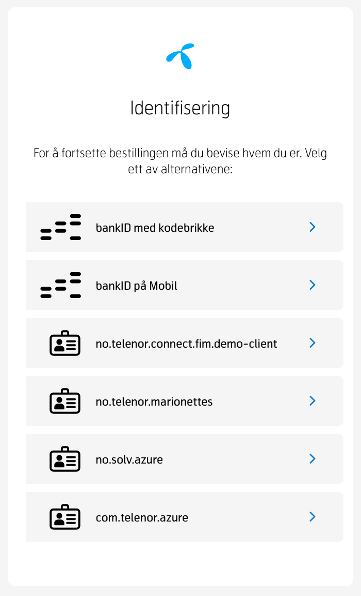
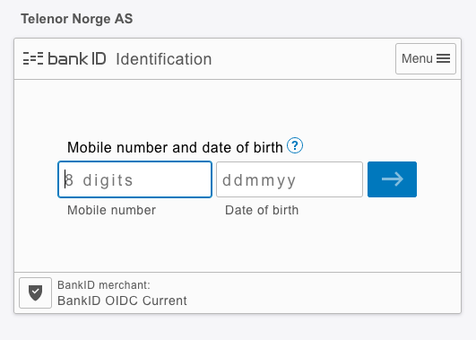

# TelenorID\+ Know Your Customer / BankId - Integration Example Step-by-step

  * [Know Your Customer / BankId](#know-your-customer-bankid)
  * [Step 1:: Start Authorization: /authorize](#step-1-start-authorization-authorize)
  * [Step 2:: IDP Selection](#step-2-idp-selection)
  * [Step 3:: Redirect to IDP](#step-3-redirect-to-idp)
  * [Step 4:: User login](#step-4-user-login)
  * [Step 5:: IBIS Callback](#step-5-ibis-callback)
  * [Step 6:: Client Callback](#step-6-client-callback)
  * [Step 7:: Fetch Tokens: /token](#step-7-fetch-tokens-token)
  * [Step 8:: Token validation and consumption](#step-8-token-validation-and-consumption)

<small><i><a href='http://ecotrust-canada.github.io/markdown-toc/'>Table of contents generated with markdown-toc</a></i></small>

## Know Your Customer / BankId
The following example is the use case for logging in with TelenorID+ \(IBIS\) using BankID.
The examples  show raw HTTP requests generated using the public debugger.

The debugger is a useful tool to validate that your client is correctly configured 
and has access to the scopes you accept.  
All public clients (i.e. "PKCE clients") are configured to work with the debugger.

The debugger is available here:
[https://oidc-test.telenor.no/](https://oidc-test.telenor.no/)

The debugger utilises the **[oidc-client-js](https://github.com/IdentityModel/oidc-client-js)** client. 
As can be seen by the parameters below there are several parameters which must be securely generated and later validated; 
we once again stress that you should **not** try to "hand craft" oauth / oidc requests.

## Step 1:: Start Authorization: /authorize 
| GET request /authorize|
| ----------- |

```HTTP
https://id-test.telenor.no/connect/authorize?client\_id=demo-client&
redirect\_uri=https://oidc-test.telenor.no//callback  
&response\_type=code&scope=openid profile ial1 vendor.verified.pid&state=2879a731de0e488b85822bdb31f5055e  
&code\_challenge=1SUn2SYhEZZZ\_HZ1u4o16JXoEBDKqkcB7YjnFrTcyAg&code\_challenge\_method=S256&
login\_hint=skip&response\_mode=query&amr=&lang=nb&context=kyc
```

| Parameter     | Type          | What / why    |
| ------------- | ---------     | ---------     |
| GET           | Http Verb     | The authorise request is done as an HTTP GET |
| https://id-test.telenor.no/connect/authorize | URI | The endpoint to start the authorise handshake |
| client\_id=demo-client | String | Plain and simple, the client Id. |
| acr\_values=urn:tnidplus:kyc | String | **This is vital to ensure that the user is only identified with BankID** |
| redirect\_uri=https://oidc-test.telenor.no//callback | URI | Where should the user to redirected after the "authorise handshake" is completed, i.e. the user has successfully logged in. In this case the Debugger. |
| response\_type=code | String | Indicates what response type you want from the authorisation server (IBIS), in this is instance we want an authorisation code. |
| scope=openid profile ial1 nin | Space-separated strings | Which scopes you are requesting on behalf of your client and user. The "nin" (national identity number) gives access to the user's id number. Please note that you must ensure that you are allowed to use this id. |
| state=2879a731de0e488b8... | String, Nonce | A nonce to prevent replay-attacks (a state should only be seen once, and must match on both ends of the transaction). |
| code\_challenge=1SUn2SYhEZZZ\_HZ1u4o16JXoEBDK... | String, PKCE | Hash of a securely, randomly generated number on the client. |
| code\_challenge\_method=S256 | String | Indications which hashing algorithm was used for the code\_challenge |
| login\_hint=skip | String | Tells IBIS that you do not want to prompt the user for their MSISDN |
| response\_mode=query | String | Tells IBIS that you want the response as query parameters ("?code=abc&foo=bar") |
| lang=nb | String | Which language to use on IDP selection screen, options are "nb" (Norsk bokmål) and "en" (English) |
| context=kyc | String | Tells IBIS which help text to show the user at the IDP selection screen, here "kyc" for Know Your Customer. |

| response /authorize |     |
| ------------------- | --- |
| **302 Found** | In this step IBIS has verified that the ClientId is correct (found) and that the provided redirect URI is configured on the client. |  
| Location: https://idp.telenorid-staging.com/Account/Login?ReturnUrl=... | IBIS will also record the state and code\_challenge parameters. |
|  | The user is then redirected to the internal controller which filters which IDPs are to be shown on the next screen. |

## Step 2:: IDP Selection
| GET request ibis/login|  |
| ----------- | --- |
| https://idp.telenorid-staging.com/ui/ibis/login?returnUrl=... | In this step IBIS will redirect to its own front-end to present the user with the "IDP selection screen". |
|   | How many IDPs are available depends on the client, sent parameters, and the subscription status of the user. |
|   | Note however that for BankID / KYC there should only be two or three available IDPs (BankId, BankId on Mobile, and Vipps). |



## Step 3:: Redirect to IDP
| request |  |
| ----------- | --- |
|`https://oidc-current.bankidapis.no/auth/realms/current/precheck/auth?**client\_id=ibis-bankid-curren**t&**redirect\_uri=https://idp.telenorid-staging.com/signin-bankid**&response\_type=code&scope=...` | Upon selection of an IDP by the user, IBIS will perform its own /authorize call \(similar to step 1\). |  
|  | This time however the ClientId will be IBIS and the redirect URI will point back to IBIS. |

## Step 4:: User login
| request |  |
| ----------- | --- |
| At this point the user will log in at their selected IDP. |  |

## Step 5:: IBIS Callback
| request |
| ----------- |
| Once the user has logged in they will be redirected back to IBIS. In the callback is IBIS's authentication code which it will use to receive tokens (id\_token, access\_tokens) from the external IDP (here BankId). |  
| This whole process is transparent to the user; they will only see the browser "flash" (between redirects). |

## Step 6:: Client Callback
| request |
| ----------- |
| `https://oidc-test.telenor.no//callback?code=pFGoYW90GWYjc5uvLgaBPBbfBFz7-nHYwjOgs6dCPJU&scope=openid%20profile%20ial1%20vendor.verified.pid&state=2879a731de0e488b85822bdb31f5055e&session\_state=Yt5xe\_vXdXILrNkLiUXMHX\_GCaLA8D9\_QqSmiQ2yTEM.wFlnswM0mOruqlq8y-e6Cg` |
| After IBIS has exchanged tokens with the external IDP it is time to redirect the user back to the original client (i.e. your app). |

| Parameter     | Type          | What / why    |
| ------------- | ---------     | ---------     |
| https://oidc-test.telenor.no//callback | URL | The address to redirect the user to, sent in as a parameter (redirect\_uri) in step 1. |
| code=pFGoYW90GWYjc5uvLgaBPBbfBFz7-nHYwjOgs6dCPJU&&& | String | The authentication code. To be used in exchange for tokens. **This is a very sensitive parameter.** |
| scope=openid%20profile%20ial1%20vendor.verified.pid | Space-separated strings | The scopes the client has been granted access to. |
|  |  | _Note: The accepted scopes may differ from those you requested; the user may not have given consent to all scopes (this is however not applicable for the KYC flow / BankId)._ |
| state=2879a731de0e488b8... | String | The same state parameter seen in step 1. |
| session\_state=Yt5xe\_vXdXILrNkLiUXMHX\_GCaLA8... | String | The IDP's (IBIS) reference to the newly created user session |

## Step 7:: Fetch Tokens: /token
| POST request |
| ----------- |
| https://idp.telenorid-staging.com/connect/token |  
| Content-Type: application/x-www-form-urlencoded | 

| Parameter     | Type          | What / why    |
| ------------- | ---------     | ---------     |
| client\_id=demo-client | String | The client Id, same as in step 1. |
| code=pFGoYW90GWYjc5... | String | The authorisation code received in step 7. |
| redirect\_uri=https%3A%2F%2Fidp.telenorid-staging.com%2Fui%2Fdebugger%2Fcallback | URI | The client's redirect URI from step 1. |
| code\_verifier=e95a91acb6554ec8a1e247330... | String, PKCE | The PKCE. Note that this time we send the actual code, not the hash. IBIS |
|   |   | will not attempt to recreate the hash seen in step 1 - they must match. |
| grant\_type=authorization\_code | String | How we request tokens, again we are using the authorization\_code flow. |

| response      |       |       |
| ------------- | ----- |------ |
| The response from step 8 will be a JSON Object containing our tokens |  |  |
| id\_token: "eyJhbGciOiJSUzI1NiIsImtpZCI6Ijc4MjM0NzU3L..." | String, JWT | See next step |
| access\_token: "eyJhbGciOiJSUzI1NiIsImtpZCI6Ijc4MjM0NzU3LWQ2OTgt..." | String, JWT | \-- |
| expires\_in: 3600 | Int, seconds | Convince property to aid the implementing developer to configure correct refresh window (Not applicable for BankId) |
| token\_type: "Bearer" | String | How the access\_token should be sent to consuming APIs (in this example, "MONA"). |
|  |  | E.g `curl -H 'Accept: application/json' -H "Authorization: Bearer ${TOKEN}" https://{hostname}/api/myresource` |
| scope: "openid profile ial1" | Space-separated strings | Convince property: Which scopes are found in the access\_token |

## Step 8:: Token validation and consumption
