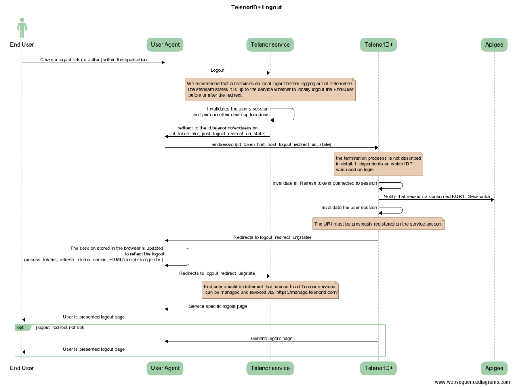
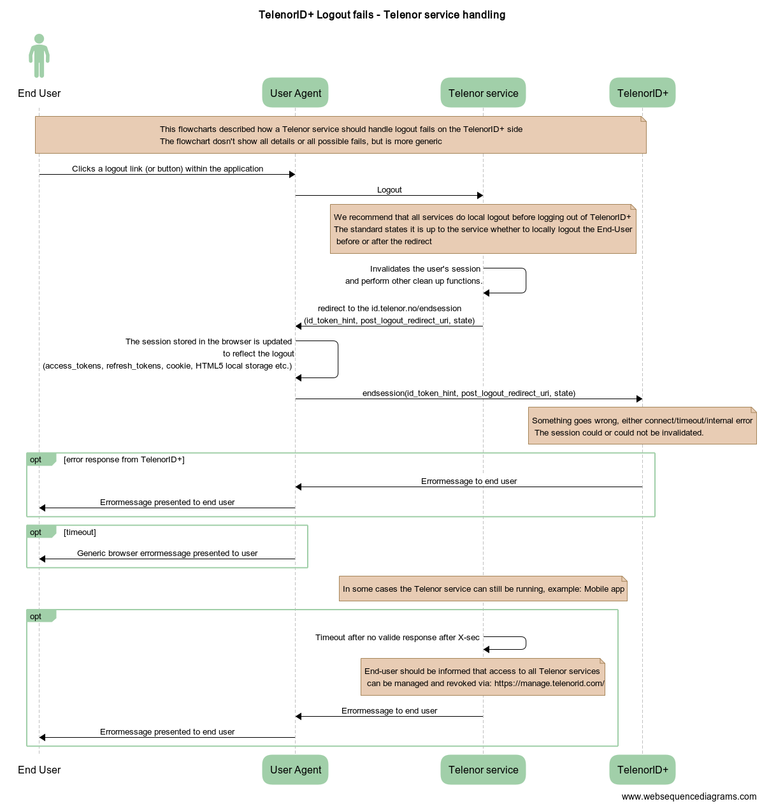

# TelenorID\+ Logout

## Get Started

Use one of these endpoints to end the user session. 
This endpoints takes an ID token as input and logs the user out.

* The service endpoint URL for logout can be retrieved here: [Telenor ID\+ discovery endpoint](https://id.telenor.no/.well-known/openid-configuration),
* there is two endpoint for logout:

| Endpoint | description | status |
| ------------- |:-------------:|:-------------:|
| ```end_session_endpoint``` | This API follows the specification: [OpenID Connect RP-Initiated Logout 1.0](https://openid.net/specs/openid-connect-rpinitiated-1_0.html) | Implemented |
| ```end_session_custom_endpoint``` | This API is a custom API created to support native apps without a userbrowser | Only design draft, not implemented |

## API descriptions

### OIDC end_session_endpoint




#### Recommandations 

The TelenorID\+ logout flow has the following recommendations for the RP extending the OpenID Connect standard:

* We recommend logging out of the local session before sending the logout request to TelenorID\+
* The logout redirect url should not be to a page where the user is logged in automatically.
* We recommend that the end-user is given information after the logout process about how to manage all tokens and logout of all Telenor services. See more information: [TelenorID\+ Manage my Telenor](TelenorID_Plus_-_ManageMyTelenor.md)
*  We recommend that the end-user is given information on error pages about how to manage all tokens and logout of all Telenor services. See more information: [TelenorID\+ Manage my Telenor](TelenorID_Plus_-_ManageMyTelenor.md)

We recommand this, but Clients can diviate from this if they require it.

The logout flow is complex with many involved parties and a logout locally first will ensure a more robust system then if the logout locally is dependent on all other moving parts. By informing the end-user about [Manage my Telenor](TelenorID_Plus_-_ManageMyTelenor.md) after logout and on error pages the end-user can follow-up on errors that occur and  make sure that the logout is complete after logging out locally. The logout page presented to the end-user after logout shouldn't try to log in the user automatically again because this can break the logout process if errors occur.

#### Input/output

The endpoint supports both HTTP GET and POST.

| Parameter | Description | Type | Required |
| ------------- |:-------------:|:-------------:|:-------------:|
| id_token_hint | The valid ID token received from authentication | String | False |
| post_logout_redirect_uri	| Location to redirect to after the logout is performed. This must match the value configured for the current clientid. | String | False |
| state | This will be returned back to the client as a query string parameter. Typically used by clients to round-trip state across the redirect | String | False |

The response can contain the following parameter:

| Parameter | Description | Type | Required |
| ------------- |:-------------:|:-------------:|:-------------:|
| state | The value specificed by the client on the request | String | False | 


More information can be found here: [API doc for the framework used by TelenorID\+](https://identityserver4.readthedocs.io/en/latest/endpoints/endsession.html#refendsession)

### TelenorID\+ custom endpoint for native apps

#### Input/output

The endpoint supports only HTTP POST.

| Parameter | Description | Type | Required |
| ------------- |:-------------:|:-------------:|:-------------:|
| id_token_hint | The valid ID token received from authentication | String | True |
| state | This will be returned back to the client as a query string parameter. Typically used by clients to round-trip state across the redirect | String | False |

The response can contain the following parameter:

| Parameter | Description | Type | Required |
| ------------- |:-------------:|:-------------:|:-------------:|
| state | The value specificed by the client on the request | String | False | 


## Error handling

The logout request can (as all requests) fail, this can result in one of the following states:


* An error pages from TelenorID\+
  * Example: Input error from the client results in a HTTP 4xx error message
  * Example: a fatal error in TelenorID\+ results in a HTTP 5xx error page
* An error page from the end-users browser
  * Example: if the request towards TelenorID\+ times out

For several of the cases the RP can't do much. We recommend the following errorhandling on the RP:

* We recommend that the end-user is given information on how to manage all tokens and logout of all Telenor services if the logout flow fails
* Some RP has the possibility to handle a missing response from TelenorID\+, for these types of clients we recommand that the RP implements a timout and that the end-user is given the same information




