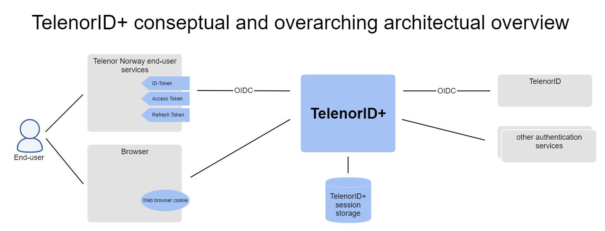

# TelenorID\+ introduction

## Main objectives for TelenorID\+

* TelenorID+ is a hub between all Telenor Norway end-users services and the different authentication services in use.
* TelenorID+ provides identification of Telenor Norway end-users.
* TelenorID+ enriches the authentication with data about the users Telenor Norway account.
* TelenorID+ keeps track of all user sessions, and authorization tokens provided to the different end-user services.
* TelenorID+ simplifies the authentication process by providing single sign on between services

## TelenorID\+ and TelenorID
Read more about the difference between TelenorID and TelenorID\+ [here](TelenorID_TelenorID_Plus_-_term.md).

## TelenorID\+ overarching architecture

TelenorID\+ is a [OpenID Connect provider (OIDC)](OIDC_basics.md) providing Telenor Norway services with ID and Access Tokens. End-user [single sign on](TelenorID_Plus_-_SSO.md) is implemented with a web browser cookie managed by  TelenorID\+.  TelenorID\+ keeps track of all sessions and tokens in a centralized session storage. TelenorID\+ integates toward several [authentication providers](@todo), where [TelenorID](https://docs.telenordigital.com/connect/) is the most important and most used provider. TelenorID and TelenorID\+ is tightly integrated to keep track of sessions between the two services.

## TelenorID\+ assuarance levels

TelenorID\+ uses different terms when it comes to identity and authentication assurance levels. We recognize both the [NIST SP 800-63-3](https://pages.nist.gov/800-63-3/) and the [eIDAS Regulation (EU)](http://eur-lex.europa.eu/legal-content/EN/TXT/?uri=uriserv%3AOJ.L_.2014.257.01.0073.01.ENG). 
[Read more...](TelenorID_Plus_-_assurance_level.md)
