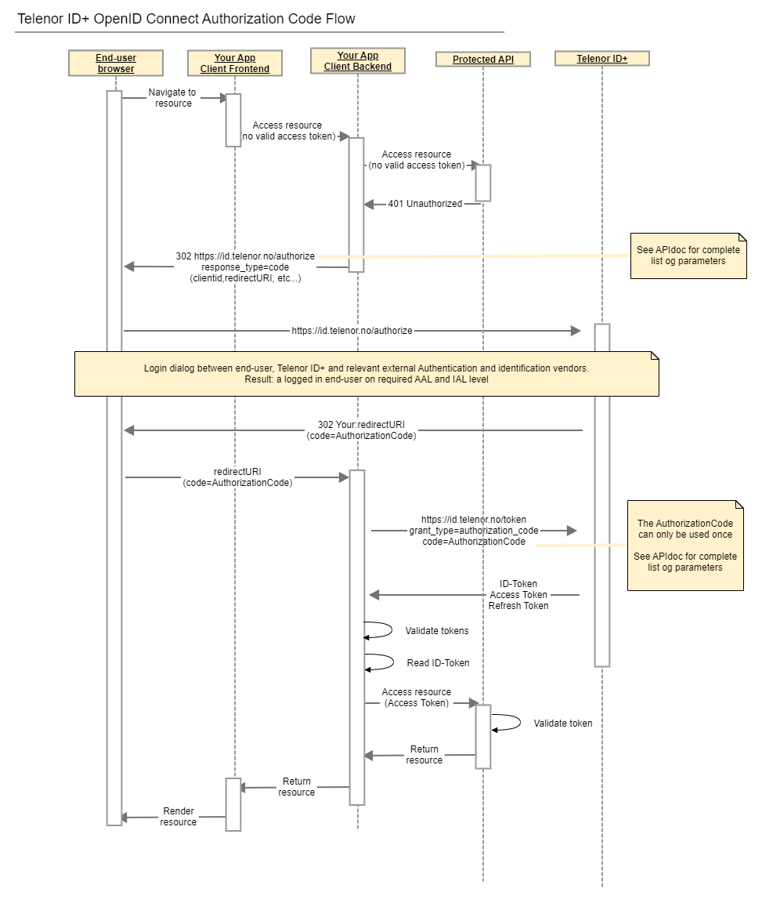

# TelenorID\+ Standard OpenID Connect \(OIDC\) Flows

- [TelenorID+ Standard OpenID Connect (OIDC) Flows](#telenorid-standard-openid-connect-oidc-flows)
  - [Standard OIDC Authorization Code Flow](#standard-oidc-authorization-code-flow)
  - [Standard OIDC Authorization Code Flow (PKCE)](#standard-oidc-authorization-code-flow-pkce)

## Standard OIDC Authorization Code Flow

## Standard OIDC Authorization Code Flow \(PKCE\)

