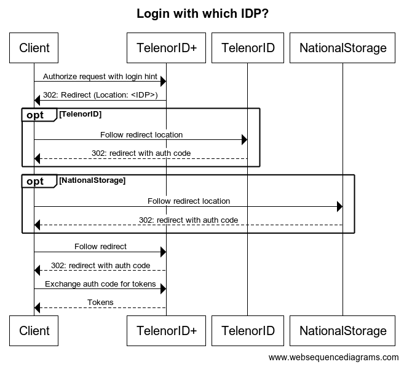

# TelenorID\+ Integration Guide: Integrate from SDK
AppSec provides SDKs to integrate Android and iOS applications with TelenorID.

   * [Benefits](#benefits)
   * [Prerequisite](#prerequisite)
   * [TelenorID\+ SDK - Android](#telenorid-sdk---android)
     + [Example](#example)
       - [Configuration](#configuration)
       - [Login](#login)
       - [Tokens](#tokens)
     + [UserInfo](#userinfo)
     + [Line authentication](#line-authentication)
       - [Personal number, with National Storage:](#personal-number-with-national-storage)
       - [Personal number](#personal-number)
       - [Non personal number](#non-personal-number)
   * [TelenorID\+ SDK - iOS](#telenorid-sdk---ios)
     + [Line authentication](#line-authentication-1)
     + [Authorize request](#authorize-request)
   * [Login flow](#login-flow)
 
 <small><i><a href='http://ecotrust-canada.github.io/markdown-toc/'>Table of contents generated with markdown-toc</a></i></small>

## Benefits
    1. Line authentication when on cellular network
    2. Easier to use than to do it all from scratch

## Prerequisite
    1. Obtain a client from the AppSec team

## TelenorID\+ SDK - Android
The Android SDK wraps the TelenorID SDK \(from Telenor Digital\) to be able to use line authentication from Telenor Digital, as well as from TelenorID\+.

For communication with the OpenID Connect provider, IBIS for TelenorID\+, the SDK uses "AppAuth for Android" SDK ([https://github.com/openid/AppAuth-Android](https://github.com/openid/AppAuth-Android))

### Example
The Android SDK provides an example application, called ExampleApplication.

#### Configuration
In ExampleApplication.onCreate() we initialize the SDK, IbisSdk.initialize with the applicationContext, 
a custom AppConfig containing clientId, redirectUri and authorizationScope, and if staging or production should be used.

```
    val appConfig = AppConfig(
        clientId = "tnn-example-android",
        redirectUri = Uri.parse("telenorid-example-android://authcallback/"),
        authorizationScope = "openid profile offline\_access")

    IbisSdk.initialize(applicationContext, appConfig, true // if use stage)
```
The redirectUri also needs to be added to build.gradle

```
manifestPlaceholders = \[
	'appAuthRedirectScheme': 'telenorid-example-android'
\]
```
#### Login
In the LoginActivity we check if the user is authorized with IbisSdk.isAuthorized(). If authorized, we start the tokenActivity instead.

The LoginActivity shows a log in button. When clicking that button a custom tab will be opened with the authorize url.

To make sure the line authentication is done before open up the custom tab, we wrap the intent in a callback, IbisSdk.checkLineAuth.

```
    IbisSdk.checkLineAuth(object : LineAuthCallback {
        override fun done() {

           createAuthRequest("")
           try {
                mAuthIntentLatch.await()
            } catch (ex: InterruptedException) {
                Log.w(TAG, "Interrupted while waiting for auth intent")
            }

            val intent: Intent = mAuthService!!.getAuthorizationRequestIntent(
                mAuthRequest.get(),
                mAuthIntent.get()
            )
            startActivityForResult(intent, RC\_AUTH)
        }
    })
```

#### Tokens
After a successful login, exchange the authorization code for tokens.

See TokenActivity exchangeAuthorizationCode.

When doing backend calls that require an access token, use the method performActionWithFreshTokens on the AuthState object. Obtained by IbisSdk.currentAuthState().performActionWithFreshTokens

### UserInfo
Use the fetchUserInfo method in IbisSdk with a TelenorIdCallback to fetch a userInfo object. The method ensures that valid tokens are being used.

### Line authentication
To be able to provide line authentication for both personal and non personal users, the SDK first obtains the msisdn, and then decides if it is a personal or non personal number.

#### Personal number, with National Storage:
No line authentication will be offered, and the user still needs to enter username and password.

#### Personal number
The TelenorID SDK then starts the SDK provided by Telenor Digital to do line authentication by Telenor Digital. This is required to be able to sign in to TelenorID at Telenor Digital. The SDK then sends an authorize request to IBIS with a session id from the Telenor Digital Line authentication.

#### Non personal number
The SDK sends an authorize request to IBIS with a session id to identify the user.

## TelenorID\+ SDK - iOS
    1.  When using the SDK for iOS users should be automatically (line authentication) signed in if on the cellular network, and using an IDP that offers it.
    2.  If the user is on WiFi, the SDK should give the application an option to inform the user to turn off the WiFi to be able to be automatically signed in.
    3.  OTP sent by SMS should be automatically copied/ pasted into the input box for OTP for Telenor Id IDP's
    4.  The SDK should use OpenId/AppAuth-iOS SDK for communication with Telenor Id. ([https://github.com/openid/AppAuth-iOS](https://github.com/openid/AppAuth-iOS)) If another client is used, it must first be approved by the DC-AppSec team.
    5.  The SDK must be easily distributed to all Telenor Id clients.

### Line authentication
To be able to do line authentication the SDK needs to do some requests on the cellular network. 
On iOS there is currently not possible to force a request on the cellular network, if the user is on WiFi. 
But there is a way of detecting if the cellular network is being used or not, which gives a possibility of informing 
the user to turn off WiFi just for a moment to be able to be signed in automatically.

Line authentication should be done in the background before the user even presses any sign in button. 
When the user presses the sign in button, the SDK must check if the line auth session has expired. 
If it has, the SDK should do another line auth, this time synchronized, and use the updated sessionId in 
the authorize request.


The following steps are necessary to do line authentication:

1.  Do a prepare call to the Aloha application. URI: /hr/v1/prepare/<log uuid>
    1.  The log uuid should be a unique for each prepare request
2.  The response is a json object with a field "injectPath"
3.  Send a request to the injectPath (it will be a http request and not https)
4.  Aloha will respond with a https redirect
5.  Follow the https redirect once again to Aloha
6.  The response should contain a sessionId ("uuid") to be used in the authorize request. And also a field "exp". "exp" is for how many seconds the session is valid.

### Authorize request
When sending the authorize request from SDK to Telenor Id, the additional parameter "aloha\_token" should be added, 
if line authentication went ok. The value should be the sessionId from the aloha response.

## Login flow

