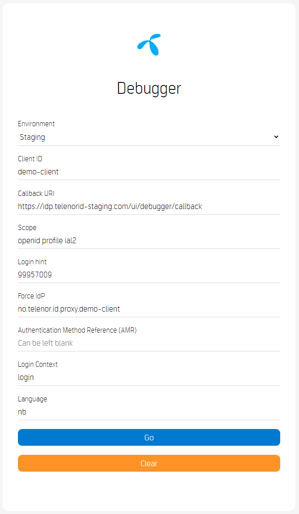
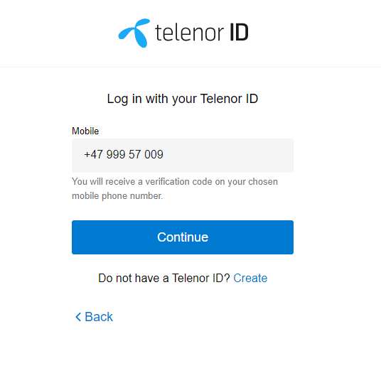
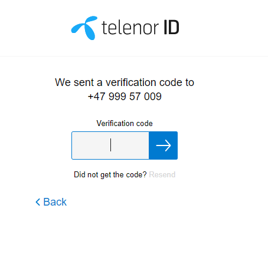
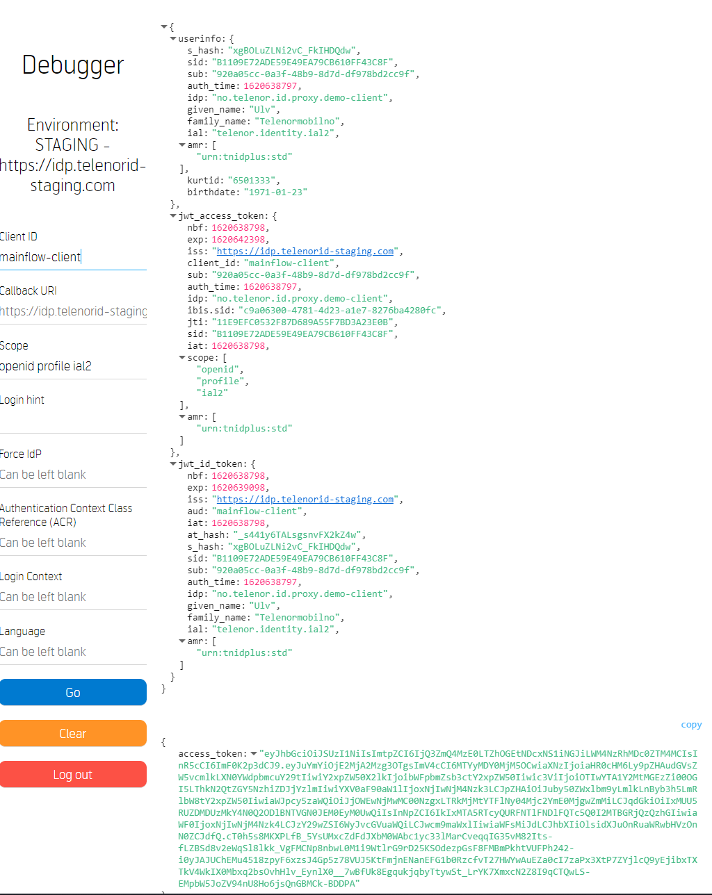
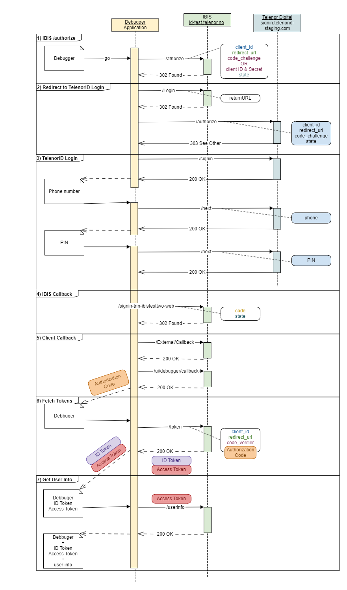

# TelenorID\+ User Login \- Integration Example Step\-by\-step
  * [User Login](#user-login)
    + [Debugger Start Page](#debugger-start-page)
  * [Step 1:: Start Authorization: /authorize](#step-1-start-authorization-authorize)
    + [/Account/login](#accountlogin)
  * [Step 2:: Redirect to TelenorID Login](#step-2-redirect-to-telenorid-login)
  * [Step 3:: User Login: Telenor ID Sign-in](#step-3-user-login-telenor-id-sign-in)
     + [Next Page](#next-page)
     + [Next Page](#next-page-1)
  * [Step 4:: IBIS Callback: Redirect from TelenorID to IBIS](#step-4-ibis-callback-redirect-from-telenorid-to-ibis)
  * [Step 5:: Client Callback: Redirect from IBIS to Client Application](#step-5-client-callback-redirect-from-ibis-to-client-application)
  * [Step 6:: Fetch Tokens: /token](#step-6-fetch-tokens-token)
  * [Step 7:: Get User Info: /userinfo](#step-7-get-user-info-userinfo)
  * [Step 8:: Check Session: /Checksession](#step-8-check-session-checksession)
  * [TelenorID\+ User Login Sequence Diagram](#telenorid-user-login-sequence-diagram)

## User Login
The following example will walk through the common use case for logging in with TelenorID\+ (IBIS).
The examples show raw HTTP requests generated using the public debugger (available here: [https://oidc-test.telenor.no/](https://oidc-test.telenor.no/)) and a *public* demo-client.  

**Thus this example uses a OpenID Connect Flow with PKCE even though most web clients will be confidential and should use the OpenID Connect Authorization Flow with client id and secret.**

The debugger utilises the **[oidc-client-js](https://github.com/IdentityModel/oidc-client-js)** client. As can be seen by the parameters in the example there are several parameters which must be securely generated and later validated; we once again stress that you should not try to "hand craft" oauth / oidc requests.

### Debugger Start Page
* https://oidc-test.telenor.no/
    * https://oidc-test.telenor.no//callback
    * openid profile ial2 tnn.ids
    * 99957009
    * Choose no.telenor.id.proxy.demo-client, or use mainflow-client to skip this choice



## Step 1:: Start Authorization: /authorize
| GET request |
| ----------- |

```HTTP
https://id-test.telenor.no/connect/authorize?client\_id=mainflow-client&
redirect\_uri=https%3A%2F%2Fidp.telenorid-staging.com%2Fui%2Fdebugger%2Fcallback&response\_type=code&scope=openid%20profile%20ial2&
state=ab1dbd3b963840b5b72a1bf76945053c&code\_challenge=qRD6s8ULvmiNvCcmnImCOhMRVH3Uwdm\_1YBAd78nc18&code\_challenge\_method=S256&
response\_mode=query&amr=&ui\_locales=no%20en&context=login
```

| Parameter     | Type          | What / why    |
| ------------- | ---------     | ---------     |
| GET           | Http Verb     | The authorise request is done as an HTTP GET |
| https://id-test.telenor.no/connect/authorize | URI | The endpoint to start the authorise handshake |
| client\_id=mainflow-client    | String | Plain and simple, the client Id. |
| redirect\_uri=https://oidc-test.telenor.no//callback | URI | Where should the user to redirected after the "authorise handshake" is completed, i.e. the user has successfully logged in. In this case the Debugger. |
| response\_type=code | String  | Indicates what response type you want from the authorisation server (IBIS), in this is instance we want an authorisation code. |
| scope=openid profile ial2     | Space-separated strings | Which scopes you are requesting on behalf of your client and user. |
| state=ab1dbd3b963840b5b72a1bf76945053c | String, Nonce | A nonce to prevent replay-attacks (a state should only be seen once, and must match on both ends of the transaction). |
| code\_challenge=qRD6s8ULvmiNvCcmnImCOhMRVH3Uwdm\_1YBAd78nc18 | String, PKCE | Hash of a securely, randomly generated number on the client. |
| code\_challenge\_method=S256  | String | Indications which hashing algorithm was used for the code\_challenge |
| login\_hint=  | String        | Tells IBIS which MSISDN to login with |
| acr\_values=  | String        | Tells IBIS which IDP to use, in this case TelenorID |
| response\_mode=query | String | Tells IBIS that you want the response as query parameters ("?code=abc&foo=bar") |
| lang=no en    | String        | Which language to use on IDP selection screen, options are "no" (Norsk bokmål) and "en" (English) |
| context=login | String        | Tells IBIS which help text to show the user at the IDP selection screen |

| response 302 Found    |       |
| ------------------    | ----  |
| | In this step IBIS has verified that the ClientId is correct (found) and that the provided redirect URI is configured on the client. |
| | IBIS will also record the state and code\_challenge parameters. |
```HTTP
Location:
https://id-test.telenor.no/Account/Login?returnUrl=/connect/authorize/callback?client\_id=mainflow-client&  
redirect\_uri=https%3A%2F%2Fidp.telenorid-staging.com%2Fui%2Fdebugger%2Fcallback&response\_type=code&scope=openid%20profile%20ial2&  
state=ab1dbd3b963840b5b72a1bf76945053c&code\_challenge=qRD6s8ULvmiNvCcmnImCOhMRVH3Uwdm\_1YBAd78nc18&  
code\_challenge\_method=S256&response\_mode=query&amr&ui\_locales=no%20en&context=login
```

### /Account/login
IBIS finner utav hvilken IDP man har lov til å logge inn med. Elvis/TelenorID.
| GET request |
| ----------- |

```HTTP
https://id-test.telenor.no/Account/Login?returnUrl=%2Fconnect%2Fauthorize%2Fcallback%3Fclient\_id%3Dmainflow-client%26  
redirect\_uri%3Dhttps%253A%252F%252Fidp.telenorid-staging.com%252Fui%252Fdebugger%252Fcallback%26response\_type%3Dcode%26scope%3Dopenid%2520profile%2520ial2%26  
state%3Dab1dbd3b963840b5b72a1bf76945053c%26code\_challenge%3DqRD6s8ULvmiNvCcmnImCOhMRVH3Uwdm\_1YBAd78nc18%26  
code\_challenge\_method%3DS256%26response\_mode%3Dquery%26amr%26ui\_locales%3Dno%2520en%26context%3Dlogin
```

| Parameter     | Type          | What / why    |
| ------------- | ---------     | ---------     |
| GET           | Http Verb     | The request is done as an HTTP GET |
| https://id-test.telenor.no/Account/Login  | URI | The endpoint to contact |
| ReturnUrl=%2Fconnect%2Fauthorize%2Fcallback... | String | The URI to return to after login |

| response 302 Found    |       |
| ------------------    | ----  |
| | The user is redirected to the internal controller which filters which IDPs are to be shown on the next screen. |   

```HTTP
Location: 
/External/Challenge?requestUrlEncoded=eyJhdXRoU2NoZW1lIjoibm8udGVsZW5vci5pZC5wcm94eS5kZW1vLWNsaWVudCIsInJld  
HVyblVybCI6Ii9jb25uZWN0L2F1dGhvcml6ZS9jYWxsYmFjaz9jbGllbnRfaWQ9bWFpbmZsb3ctY2xpZW50XHUwMDI2cmVkaXJlY3Rf  
dXJpPWh0dHBzJTNBJTJGJTJGaWRwLnRlbGVub3JpZC1zdGFnaW5nLmNvbSUyRnVpJTJGZGVidWdnZXIlMkZjYWxsYmFja1x1MDAy  
NnJlc3BvbnNlX3R5cGU9Y29kZVx1MDAyNnNjb3BlPW9wZW5pZCUyMHByb2ZpbGUlMjBpYWwyXHUwMDI2c3RhdGU9YWIxZGJk  
M2I5NjM4NDBiNWI3MmExYmY3Njk0NTA1M2NcdTAwMjZjb2RlX2NoYWxsZW5nZT1xUkQ2czhVTHZtaU52Q2NtbkltQ09oTVJWS  
DNVd2RtXzFZQkFkNzhuYzE4XHUwMDI2Y29kZV9jaGFsbGVuZ2VfbWV0aG9kPVMyNTZcdTAwMjZyZXNwb25zZV9tb2RlPXF1ZXJ5  
XHUwMDI2YW1yXHUwMDI2dWlfbG9jYWxlcz1ubyUyMGVuXHUwMDI2Y29udGV4dD1sb2dpbiIsInJlZGlyZWN0VXJpIjoiaHR0cHM  
6Ly9pZHAudGVsZW5vcmlkLXN0YWdpbmcuY29tL3VpL2RlYnVnZ2VyL2NhbGxiYWNrIiwibG9naW5IaW50IjoiOTk5NTcwMDkiLCJsY  
W5ndWFnZSI6Im5vIGVuIiwibG9naW5Db250ZXh0IjoibG9naW4iLCJjbGllbnRJZCI6Im1haW5mbG93LWNsaWVudCIsImluaXRpYXRl  
ZEF0IjoiMjAyMS0wNS0xMFQwOToyNjoyOC40MzAxNzg4WiIsImF1dGhvcml6ZVBhcmFtcyI6eyJhY3JWYWx1ZXMiOiJ1cm46dG5pZ  
HBsdXM6c3RkIiwiZXJyb3JDb2RlIjowfSwiZXJyb3JDb2RlIjowfQ
```

## Step 2:: Redirect to TelenorID Login
IBIS will perform its own /authorize call (similar to [Step 1:: Start Authorization: /authorize](#step-1-start-authorization-authorize) towards the selected IDP, in this case TelenorID.  
This time however the ClientId will be IBIS and the redirect URI will point back to IBIS.

| GET request |
| ----------- |

```HTTP
https://signin.telenorid-staging.com/oauth/authorize?client\_id=tnn-ibistesttwo-web&redirect\_uri=https%3A%2F%2Fid-test.telenor.no%2Fsignin-tnn-ibistesttwo-web&response\_type=code&  
scope=openid%20profile%20email%20phone&code\_challenge=v0wdcyZ-P3LgTP17vPmElgtBcIxW8Cbst6irXv1wfhA&code\_challenge\_method=S256&response\_mode=form\_post&  
nonce=637562355885178265.NGVkZWFmNTYtMjBkZi00NjlmLWIwN2EtMWUxNDM2MWM5MGRhMDk0NGE2MzItYmM5YS00OWQyLWJmMGMtNjJlZThmMDdkNDI2&acr\_values=2&  
ui\_locales=no%20en&claims=%7B%22id\_token%22%3A%7B%22phone\_number%22%3A%7B%22essential%22%3Atrue%7D%2C%22email%22%3A%7B%22essential%22%3Atrue%7D%7D%7D&  
login\_hint=%2B4799957009&state=CfDJ8KA\_0MCpmkxDr6\_f25p5Z6N\_gpjS6K4IRqCn\_YuIDIDS58MNzIDZ\_pVGGTyCsHkQ3Yvpsm31mxuncz30vZHNHlqSTXXgIyUCIdfMUg7RBqQzCBvpSJVZ4zsRgIhk  
lKVqjcAiPsKfckF3NBM4BzeVVuqYDFPtbj-M1pFzOgpxg9g1GQuxh-zj2HW71ilU0ZLQZlorRFlwgf5QoX8hsQvC3xEPx8agey321PTaEbJHuusY9aNYldSPPkja-vn2JJy-qYrWv7bZcpVZWZf5qYyZVGuGO1bn  
DORqPjInu3oy3EqYArsprSmZqmCod87Zt2kC6\_rqWtwjavUS3ltuFLKSgfmX2vz3LxmvetYM004nr9S5SWzGxpSo6fgFBcA1RV8uhsGZqQsRQG8nIxFfoG3U-bkXjoSmIzrs4UH8A529ES4uARf1aOewgF3fRv  
43q2nKBcDNMopaTAqL2vv7ijeO5QSW84GrqWYoh0YV558iiWYs7Hs-3MJQ\_w9ZCplIxQ4HfnKiSvpjConMPqPjeeREychtwViChsUEva4Z-6ccJ0xL2gFkiJJaFm\_si0XdiUJjATRdrroeycrHRVtrjmXMzddBc7fUk  
J16iCVW0dIOL0w7AJMwpG2xTlwLh5iKTCTOwxi6dFvO2BoDvA-6pJNOcPOiqeoHRZiQwQvrnDmo\_tesY0U3Ripq4jyxKZZvmVO-Q0H5miBUTi6MsI0AKtnHd5qj\_\_1HWTcDydDEjj1k59w\_F7WhXjJxJv7Hz2  
vpp3knyPin9U7vdKd\_VrCZe1Q4TTvug9KoxP9wW8Gk0qTbjGOsWEjz4aujb1rJMqYVA5qiqEVwTSCXLdduQ3ggt\_wmMCTIAIuHUiZ2LtCCA7Hb44M4620d0i\_CbwUElkB2P8N-MFJvxB-UmENmSS1UsF3w  
kt08IDoBgmRaoKDJWh9G8ey1woyNVhd0GlAwVF45aWNgqjv1zFSjSw6vjQiYCANQvvhYjAI\_nknNM3fLu1cVZoQoaPi8AQELuBJBSrawgnBWwJNBhze1zLXAp\_HMp1KvNfB1fJ60NXGfhjBNguSng-Ml3hl  
U1okl\_mQSavPYedHi\_m0JZZcjXxVbmAgsQZPG1Sc
```

| Parameter     | Type          | What / why    |
| ------------- | ---------     | ---------     |
| GET           | Http Verb     | The request is done as an HTTP GET |
| https://signin.telenorid-staging.com/oauth/authorize  | URI | The endpoint to start Telenor ID authorize handshake |
| client\_id=tnn-ibistesttwo-web | String | The IBIS client ID |
| redirect\_uri=https%3A%2F%2Fid-test.telenor.no%2Fsignin-tnn-ibistesttwo-web | URI | Where should the user be redirected to after the "authorise handshake" is completed, i.e. the user has successfully logged in. |
| response\_type=code | String | Indicates what response type IBIS want from the authorisation server (Telenor ID), in this is instance IBIS want an authorisation code. |
| scope=openid%20profile%20email%20phone | Space-separated strings | Which scopes IBIS are requesting on behalf of your client and user. |
| code\_challenge=v0wdcyZ-P3LgTP17vPmElgtBcIxW8Cbst6irXv1wfhA | String, PKCE | Hash of a securely, randomly generated number in IBIS. |
| code\_challenge\_method=S256 | String | Indications which hashing algorithm was used for the code\_challenge |
| response\_mode=form\_post | String | Tells Telenor ID that IBIS want the response as form\_post |
| nonce=637562355885178265.NGVkZWFmNTYtMjBkZi00Njlm... | String, Nonce | |
| login\_hint=%2B4799957008 | String | Tells Telenor ID which MSISDN to prompt the user for at login |
| state=CfDJ8KA\_0MCpmkxDr6\_f25p5Z6N\_gpjS6K4IRqCn\_YuIDIDS58MN... | String, Nonce | A nonce to prevent replay-attacks (a state should only be seen once, and must match on both ends of the transaction). |

| response 303 See Other    |       |
| ------------------------- | ----- |

```HTTP
Location:
https://signin.telenorid-staging.com/v2/signin?authentication\_request=eyJraWQiOiIxIiwiYWxnIjoiUlMyNTYifQ.eyJsb2MiOiJubyIsImxzaSI6ImYxN2IxMzRjLWY1ZWYtNGUyZi1iZjUxLThiM2I5O  
DQzN2ZmYiIsImxvaCI6WyIrNDc5OTk1NzAwOSJdLCJzZHYiOm51bGwsInB1bCI6ZmFsc2UsInN1aSI6bnVsbCwiYWFoIjpudWxsLCJoZWUiOnRydWUsInN1biI6bnVsbCwicHV0IjoibXNpc2RuIiwiY  
WNyIjpbIjIiXSwiYnJkIjoidGVsZW5vcmlkIiwiaGV0IjpudWxsLCJzZW4iOm51bGwsInNhbSI6W10sInJlcyI6Inc3c3VVaVNzU0kwWnJkMkJ2aXk5MjJNVnZsMSIsInNhcCI6IndlYiIsImFwdCI6IndlYiIsInN  
hdCI6bnVsbCwic2xhIjpudWxsLCJ0YXUiOmZhbHNlLCJhdWMiOiJodHRwczpcL1wvc2lnbmluLnRlbGVub3JpZC1zdGFnaW5nLmNvbVwvb2F1dGhcL2F1dGhlbnRpY2F0aW9uX2NhbGxiYWNrIiwib  
HByIjpmYWxzZSwibnByIjpmYWxzZSwiZXNjIjpbImVtYWlsIiwicGhvbmVfbnVtYmVyIl0sIm5sciI6ZmFsc2UsInNscyI6dHJ1ZSwic2x1Ijp0cnVlLCJkaWQiOm51bGwsImNpZCI6InRubi1pYmlzdGVzdHR  
3by13ZWIifQ.E\_NEaIbLxnK02TbkTr-Ajl4Zwk3fT3pPCkwmrzOYOFKEprT49E7htbZKjQfqMn7IHF8TJKWcI2VI\_9HbU99dvHBjTVUGGzIg91\_5KHlwpty7Ntk9JrhNtZcseVAvHI05cr9vOaRWnoVxixztEE  
kqfY0-NasiMqsixW0ZW41widc
```
## Step 3:: User Login: Telenor ID Sign-in
The user will log in at the selected IDP, here Telenor ID at Telenor Digital

| GET request |
| ----------- |

```HTTP
https://signin.telenorid-staging.com/v2/signin?authentication\_request=eyJraWQiOiIxIiwiYWxnIjoiUlMyNTYifQ.eyJsb2MiOiJubyIsImxzaSI6ImYxN2IxMzRjLWY1ZWYtNGUyZi1iZjUxL  
ThiM2I5ODQzN2ZmYiIsImxvaCI6WyIrNDc5OTk1NzAwOSJdLCJzZHYiOm51bGwsInB1bCI6ZmFsc2UsInN1aSI6bnVsbCwiYWFoIjpudWxsLCJoZWUiOnRydWUsInN1biI6bnVsbCwicHV  
0IjoibXNpc2RuIiwiYWNyIjpbIjIiXSwiYnJkIjoidGVsZW5vcmlkIiwiaGV0IjpudWxsLCJzZW4iOm51bGwsInNhbSI6W10sInJlcyI6Inc3c3VVaVNzU0kwWnJkMkJ2aXk5MjJNVnZsMSIsInNhcC  
I6IndlYiIsImFwdCI6IndlYiIsInNhdCI6bnVsbCwic2xhIjpudWxsLCJ0YXUiOmZhbHNlLCJhdWMiOiJodHRwczpcL1wvc2lnbmluLnRlbGVub3JpZC1zdGFnaW5nLmNvbVwvb2F1dGhcL2F1  
dGhlbnRpY2F0aW9uX2NhbGxiYWNrIiwibHByIjpmYWxzZSwibnByIjpmYWxzZSwiZXNjIjpbImVtYWlsIiwicGhvbmVfbnVtYmVyIl0sIm5sciI6ZmFsc2UsInNscyI6dHJ1ZSwic2x1Ijp0cnVlLCJ  
kaWQiOm51bGwsImNpZCI6InRubi1pYmlzdGVzdHR3by13ZWIifQ.E\_NEaIbLxnK02TbkTr-Ajl4Zwk3fT3pPCkwmrzOYOFKEprT49E7htbZKjQfqMn7IHF8TJKWcI2VI\_9HbU99dvHBjTVUGG  
zIg91\_5KHlwpty7Ntk9JrhNtZcseVAvHI05cr9vOaRWnoVxixztEEkqfY0-NasiMqsixW0ZW41widc
```

| Parameter     | Type          | What / why    |
| ------------- | ---------     | ---------     |
| GET           | Http Verb     | The request is done as an HTTP GET |
| https://connect.staging.telenordigital.com/id/signin | URI | The endpoint at Telenor Digital to contact |
| authentication\_request=eyJraWQiOiIxIiwiYWxnIjoiUlMyNTYifQ.e.... | String | |

| response 200 OK    |       |
| ------------------ | ----- |



### Next Page
| POST request |
| ------------ |
| https://signin.telenorid-staging.com/v2/api/next |


| Parameter     | Type          | What / why    |
| ------------- | ---------     | ---------     |
| POST           | Http Verb     | The request is done as an HTTP POST |
| https://signin.telenorid-staging.com/v2/api/next | URI | The endpoint to contact |
| username=%2B47%20999%2057%20009 | String | |
| nounce=03b066f3-d805-42d7-a7ea-592fd0634a91 | String, nonce | |
| stay\_signed\_in=false | | |

| response 200 OK    |       |
| ------------------ | ----- |



### Next Page
| POST request |
| ------------ |
| https://signin.telenorid-staging.com/v2/api/next |


| Parameter     | Type          | What / why    |
| ------------- | ---------     | ---------     |
| POST          | Http Verb     | The request is done as an HTTP POST |
| https://signin.telenorid-staging.com/v2/api/next | URI | The endpoint to contact |
| pin=\*\*\*\*  | String        | The PIN code entered by the End User |
| nounce=b3dd1f00-8318-46d1-9f15-6a96ef431ad6 | String, nonce | |
  
| response 200 OK    |       |
| ------------------ | ----- |

## Step 4:: IBIS Callback: Redirect from TelenorID to IBIS
Once the user has logged in they will be redirected back to IBIS. In the callback is IBIS's authentication code which IBIS will use to receive tokens (id\_token, access\_tokens) from the external IDP (here Telenor ID at Telenor Digital).  
This whole process is transparent to the user; they will only see the browser "flash" (between redirects).

| GET request |
| ----------- |

```HTTP
https://id-test.telenor.no/signin-tnn-ibistesttwo-web?code=tsWOTDhdHxM3XLrZqPbpLECqBRU&state=CfDJ8KA\_0MCpmkxDr6\_f25p5Z6N\_gpjS6K4IRqCn\_YuIDIDS58MNzIDZ\_pVG  
GTyCsHkQ3Yvpsm31mxuncz30vZHNHlqSTXXgIyUCIdfMUg7RBqQzCBvpSJVZ4zsRgIhklKVqjcAiPsKfckF3NBM4BzeVVuqYDFPtbj-M1pFzOgpxg9g1GQuxh-zj2HW71ilU0ZLQZlorRFlwgf  
5QoX8hsQvC3xEPx8agey321PTaEbJHuusY9aNYldSPPkja-vn2JJy-qYrWv7bZcpVZWZf5qYyZVGuGO1bnDORqPjInu3oy3EqYArsprSmZqmCod87Zt2kC6\_rqWtwjavUS3ltuFLKSgfmX2vz3Lx  
mvetYM004nr9S5SWzGxpSo6fgFBcA1RV8uhsGZqQsRQG8nIxFfoG3U-bkXjoSmIzrs4UH8A529ES4uARf1aOewgF3fRv43q2nKBcDNMopaTAqL2vv7ijeO5QSW84GrqWYoh0YV558iiWYs7H  
s-3MJQ\_w9ZCplIxQ4HfnKiSvpjConMPqPjeeREychtwViChsUEva4Z-6ccJ0xL2gFkiJJaFm\_si0XdiUJjATRdrroeycrHRVtrjmXMzddBc7fUkJ16iCVW0dIOL0w7AJMwpG2xTlwLh5iKTCTOwxi6dFv  
O2BoDvA-6pJNOcPOiqeoHRZiQwQvrnDmo\_tesY0U3Ripq4jyxKZZvmVO-Q0H5miBUTi6MsI0AKtnHd5qj\_\_1HWTcDydDEjj1k59w\_F7WhXjJxJv7Hz2vpp3knyPin9U7vdKd\_VrCZe1Q4TTvug  
9KoxP9wW8Gk0qTbjGOsWEjz4aujb1rJMqYVA5qiqEVwTSCXLdduQ3ggt\_wmMCTIAIuHUiZ2LtCCA7Hb44M4620d0i\_CbwUElkB2P8N-MFJvxB-UmENmSS1UsF3wkt08IDoBgmRaoKDJWh9  
G8ey1woyNVhd0GlAwVF45aWNgqjv1zFSjSw6vjQiYCANQvvhYjAI\_nknNM3fLu1cVZoQoaPi8AQELuBJBSrawgnBWwJNBhze1zLXAp\_HMp1KvNfB1fJ60NXGfhjBNguSng-Ml3hlU1okl\_mQS  
avPYedHi\_m0JZZcjXxVbmAgsQZPG1Sc
```

| Parameter     | Type          | What / why    |
| ------------- | ---------     | ---------     |
| GET           | Http Verb     | The request is done as an HTTP GET |
| https://idp.telenorid-staging.com/signin-tnn-ibistesttwo-web | URI | The endpoint to contact |
| code=tsWOTDhdHxM3XLrZqPbpLECqBRU | String | authentication code |
| state=CfDJ8KA\_0MCpmkxDr6\_f25p5Z6N\_gpjS6K4IR... | String | |

| response 302 Found    |       |
| ------------------    | ----  |
| | The user is redirected to the internal controller which filters which IDPs are to be shown on the next screen. |   

```HTTP
Location: 
/External/Callback
```

## Step 5:: Client Callback: Redirect from IBIS to Client Application
After IBIS has exchanged tokens with the external IDP it is time to redirect the user back to the original client (i.e. your app) - here the demo debugger 

| GET request |
| ----------- |

```HTTP
https://oidc-test.telenor.no//callback?code=2E686206E5F07FF20338EC93F5C630A24E1BA4B2FE1F931ED206C88CED68DAD6&  
scope=openid%20profile%20ial2&state=7e4f397b7cc94717bd57ce65d1daa1e6&  
session\_state=ohX8CT0saGEyBpDWgtHPEqi1mio\_HxIWEeC5LVTap1g.28D0EA52A8BE49912DDE6437B8B1EC55
```

| Parameter     | Type          | What / why    |
| ------------- | ---------     | ---------     |
| GET           | Http Verb     | The request is done as an HTTP GET |
| https://oidc-test.telenor.no//callback | URI | The address to redirect the user to, sent in as a parameter (redirect\_uri) in [Step 1:: Start Authorization: /authorize](#step-1-start-authorization-authorize). In this case, the Debugger. |
| code=04E9BD43396A20EE04BD13CC6D46B0A9B43E4CC7E6F5E2797CD07670C9DB2E22 | String | **The Authentication Code.** To be used in exchange for tokens. *This is a very sensitive parameter.* |
| scope=openid%20profile%20ial2 |  | The scopes the client has been granted access to. _Note: The accepted scopes may differ from those you requested; the user may not have given consent to all scopes_ |
| state=ab1dbd3b963840b5b72a1bf76945053c |  | The same state parameter seen in [Step 1:: Start Authorization: /authorize](#step-1-start-authorization-authorize). |
| session\_state=0fi9HY43J9W8HcnWFhyKR5ywyx72kmEPwmySwPnnQow.83403AEBA2CFB1315539B3B35166F82D | | The IBIS reference to the newly created user session |

| response 200 OK    |       |
| ------------------ | ----- |

## Step 6:: Fetch Tokens: /token
| POST request |
| ------------ |
| https://id-test.telenorid.no/connect/token |

| Parameter     | Type          | What / why    |
| ------------- | ---------     | ---------     |
| POST          | Http Verb     | The request is done as an HTTP POST |
| https://id-test.telenorid.no/connect/token | URI | The endpoint to contact |
| client\_id=mainflow-client | String | The client ID, same as in [Step 1:: Start Authorization: /authorize](#step-1-start-authorization-authorize). |
| code=04E9BD43396A20EE04BD13CC6D46B0A9B43E4CC7E6F5E2797CD07670C9DB2E22 | String | **The Authentication Code.** Received in [Step 5:: Client Callback: Redirect from IBIS to Client Application](#step-5-client-callback-redirect-from-ibis-to-client-application). |
| redirect\_uri=https%3A%2F%2Fidp.telenorid-staging.com%2Fui%2Fdebugger%2Fcallback | URI | The client's redirect URI from [Step 1:: Start Authorization: /authorize](#step-1-start-authorization-authorize). |
| code\_verifier=5d3c6ab1d5d346b38cf0223c4c1fb96f9f10a782956a40a885f9e19f277b6608955b3b0677f64eada2a0e86d56070213 | String, PKCE | The PKCE. Note that this time we send the actual code, not the hash. IBIS will not attempt to recreate the hash seen in [Step 1:: Start Authorization: /authorize](#step-1-start-authorization-authorize) - they must match. |
| grant\_type=authorization\_code | String | How we request tokens, again we are using the authorization\_code flow. |

| response 200 OK    |       |          |
| :----------------- | ----- | -------- |
| The response from [Step 6:: Fetch Tokens: /token](#step-6-fetch-tokens-token) will be a JSON Object containing our tokens | | |
| access\_token: "eyJhbGciOiJSUzI1NiIsImtpZCI6IjQ3ZmQ4MzE0LTZhOGEtNDcxNS1i..."  | String, JWT   | **The Access Token** |
| id\_token: "eyJhbGciOiJSUzI1NiIsImtpZCI6IjQ3ZmQ4MzE0LTZhOGEtNDcxNS1iNGJi..."  | String, JWT   | **The ID Token**     |
| expires\_in: 3600                                                             | Int, Seconds  | Convince property to aid the implementing developer to configure correct refresh window |
| scope: "openid profile ial2"                                                  | Space-separated strings | Convince property: Which scopes are found in the access\_token |
| token\_type: "Bearer"                                                         | String        | How the access\_token should be sent to consuming APIs. |
|                                                                               |               | Eg. `curl -H 'Accept: application/json' -H "Authorization: Bearer ${TOKEN}" https://{hostname}/api/myresource` |

## Step 7:: Get User Info: /userinfo
| GET request                               |
| ----------------------------------------- |
| https://id-test.telenor.no/connect/userinfo    | 

| Parameter     | Type          | What / why    |
| ------------- | ---------     | ---------     |
| GET           | Http Verb     | The request is done as an HTTP GET |
| https://id.telenor.no/connect/userinfo    | URI   | The endpoint to contact using **The Access Token** Received in [Step 6:: Fetch Tokens: /token](#step-6-fetch-tokens-token) |
|               |               | Eg. `curl "https://id-test.telenor.no/connect/userinfo" -H "Authorization: Bearer ${TOKEN}"` |

| response 200 OK    |
| :----------------- |
| birthdate: "1971-01-23" |
| family\_name: "Telenormobilno" | 
| given\_name: "Ulv" |
| ial: "telenor.identity.ial2" |
| kurtid: "6501333" |
| sub: "920a05cc-0a3f-48b9-8d7d-df978bd2cc9f" |

## Step 8:: Check Session: /Checksession
| GET request                               |
| ----------------------------------------- |
| https://id-test.telenor.no/connect/checksession    | 

| Parameter     | Type          | What / why    |
| ------------- | ---------     | ---------     |
| GET           | Http Verb     | The request is done as an HTTP GET |
| https://id-test.telenor.no/connect/checksession   | URI   | The endpoint to contact |
|                                           |       | Eg. `curl "https://id-test.telenor.no/connect/userinfo" -H "Authorization: Bearer ${TOKEN}"` |

| response 200 OK    |
| :----------------- |



```javascript
{
    userinfo:{
        s\_hash:"xgBOLuZLNi2vC\_FkIHDQdw"
        sid:"B1109E72ADE59E49EA79CB610FF43C8F"
        sub:"920a05cc-0a3f-48b9-8d7d-df978bd2cc9f"
        auth\_time:1620638797
        idp:"no.telenor.id.proxy.demo-client"
        given\_name:"Ulv"
        family\_name:"Telenormobilno"
        ial:"telenor.identity.ial2"
        amr:\[
            "urn:tnidplus:std"
        \]
        kurtid:"6501333"
        birthdate:"1971-01-23"
    }
    jwt\_access\_token:{
        nbf:1620638798
        exp:1620642398
        iss:"https://idp.telenorid-staging.com"
        client\_id:"mainflow-client"
        sub:"920a05cc-0a3f-48b9-8d7d-df978bd2cc9f"
        auth\_time:1620638797
        idp:"no.telenor.id.proxy.demo-client"
        ibis.sid:"c9a06300-4781-4d23-a1e7-8276ba4280fc"
        jti:"11E9EFC0532F87D689A55F7BD3A23E0B"
        sid:"B1109E72ADE59E49EA79CB610FF43C8F"
        iat:1620638798
        scope:\[
            "openid"
            "profile"
            "ial2"
        \]
        amr:\[
            "urn:tnidplus:std"
        \]
    }
    jwt\_id\_token:{
        nbf:1620638798
        exp:1620639098
        iss:"https://idp.telenorid-staging.com"
        aud:"mainflow-client"
        iat:1620638798
        at\_hash:"\_s441y6TALsgsnvFX2kZ4w"
        s\_hash:"xgBOLuZLNi2vC\_FkIHDQdw"
        sid:"B1109E72ADE59E49EA79CB610FF43C8F"
        sub:"920a05cc-0a3f-48b9-8d7d-df978bd2cc9f"
        auth\_time:1620638797
        idp:"no.telenor.id.proxy.demo-client"
        given\_name:"Ulv"
        family\_name:"Telenormobilno"
        ial:"telenor.identity.ial2"
        amr:\[
            "urn:tnidplus:std"
        \]
    }
}
copy
{
    access\_token:"eyJhbGciOiJSUzI1NiIsImtpZCI6IjQ3ZmQ4MzE0LTZhOGEtNDcxNS1iNGJiLWM4NzRhMDc0ZTM4MCIsInR5cCI6ImF0K2p3dCJ9.eyJuYmYiOjE2MjA2Mzg3OTgsImV4cCI6MTYyMDY0MjM5OCwiaXNzIjoiaHR0cHM6Ly9pZHAudGVsZW5vcmlkLXN0YWdpbmcuY29tIiwiY2xpZW50X2lkIjoibWFpbmZsb3ctY2xpZW50Iiwic3ViIjoiOTIwYTA1Y2MtMGEzZi00OGI5LThkN2QtZGY5NzhiZDJjYzlmIiwiYXV0aF90aW1lIjoxNjIwNjM4Nzk3LCJpZHAiOiJuby50ZWxlbm9yLmlkLnByb3h5LmRlbW8tY2xpZW50IiwiaWJpcy5zaWQiOiJjOWEwNjMwMC00NzgxLTRkMjMtYTFlNy04Mjc2YmE0MjgwZmMiLCJqdGkiOiIxMUU5RUZDMDUzMkY4N0Q2ODlBNTVGN0JEM0EyM0UwQiIsInNpZCI6IkIxMTA5RTcyQURFNTlFNDlFQTc5Q0I2MTBGRjQzQzhGIiwiaWF0IjoxNjIwNjM4Nzk4LCJzY29wZSI6WyJvcGVuaWQiLCJwcm9maWxlIiwiaWFsMiJdLCJhbXIiOlsidXJuOnRuaWRwbHVzOnN0ZCJdfQ.cT0h5s8MKXPLfB\_5YsUMxcZdFdJXbM0WAbc1yc33lMarCveqqIG35vM82Its-fLZBSd8v2eWqSl8lkk\_VgFMCNp8nbwL0M1i9WtlrG9rD25KSOdezpGsF8FMBmPkhtVUFPh242-i0yJAJUChEMu4518zpyF6xzsJ4Gp5z78VUJ5KtFmjnENanEFG1b0RzcfvT27HWYwAuEZa0cI7zaPx3XtP7ZYjlcQ9yEjibxTXTkV4WkIX0Mbxq2bsOvhHlv\_EynlX0\_\_7wBfUk8EgqukjqbyTtywSt\_LrYK7XmxcN2Z8I9qCTQwLS-EMpbW5JoZV94nU8Ho6jsQnGBMCk-BDDPA"
}
```
## TelenorID\+ User Login Sequence Diagram


