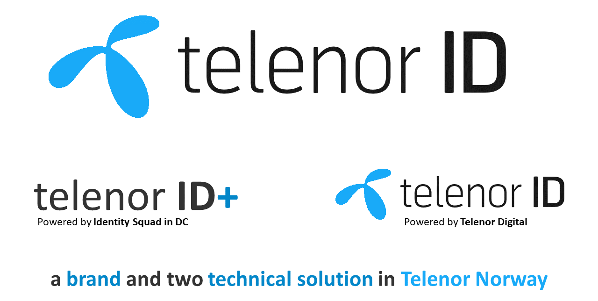

# TelenorID vs. TelenorID\+

TelenorID is first the brand used towards end-users for authentication in all Telenor countries.
In addition to this TelenorID is a common technical authentication services used in all Telenor countries.
The TelenorID technical service has only common autentication functionality needed in all countries.
TelenorID\+ is the extra add-on needed in Norway, providing identification of Norwegian Telenor users.

## TelenorID\+ and TelenorID
[TelenorID](https://docs.telenordigital.com/connect/) is the main authentication provider used by TelenorID\+ (but not the only one). TelenorID is a service provided by [Telenor Digital](https://www.telenordigital.com/).

TelenorID\+ is only a name for a collection of technical microservices and not branded or visible for end-users, the brandname for authentication for end-users is always TelenorID.

Read more about TelenorID\+ [here](TelenorID_Plus_-_intro.md).