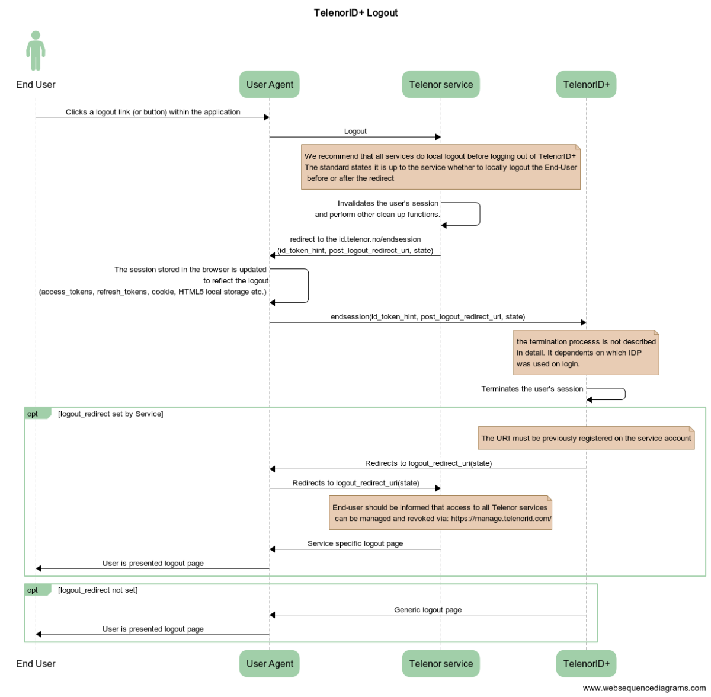
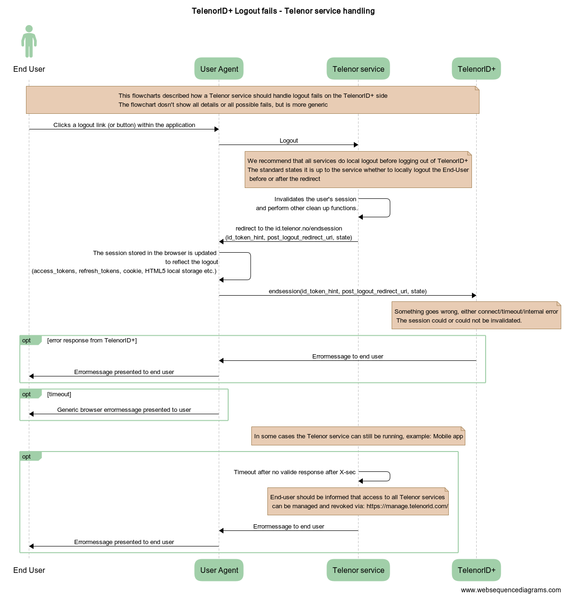

# TelenorID\+ Logout

- [TelenorID\+ Logout](#telenorid---logout)
  * [Get Started](#get-started)
  * [Logout flow](#logout-flow)
  * [Input/output](#input-output)
  * [Error handling](#error-handling)
  

## Get Started

Use this endpoint to end the user session. This endpoint takes an ID token and logs the user out.
The Telenor service using the TelenorID\+ endpoint has the role as [Relying Party(RP)](https://en.wikipedia.org/wiki/Relying_party)

* The service endpoint for logout can be retrieved  here: [Telenor ID\+ discovery endpoint "end_session_endpoint"](https://id.telenor.no/.well-known/openid-configuration)
* The logout API follows the specification: [OpenID Connect RP-Initiated Logout 1.0](https://openid.net/specs/openid-connect-rpinitiated-1_0.html)

## Logout flow

The TelenorID\+ logout flow has the following requirements for the RP extending the OpenID Connect standard:

* We recommend logging out of the local session before sending the logout request to TelenorID\+
* We recommend that the end-user is given information after the logout process about how to manage all tokens and logout of all Telenor services

## Input/output

The endpoint supports both HTTP GET and POST.

| Parameter | Description | Type | Required |
| ------------- |:-------------:|:-------------:|:-------------:|
| id_token_hint | The valid ID token received from authentication | String | True |
| post_logout_redirect_uri	| Location to redirect to after the logout is performed. This must match the value configured for the current clientid. | String | False |
| state | This will be returned back to the client as a query string parameter. Typically used by clients to round-trip state across the redirect | String | False |

The response can contain the following parameter:

| Parameter | Description | Type | Required |
| ------------- |:-------------:|:-------------:|:-------------:|
| state | The value spacificed by the client on the request | String | False | 

More information can be found her: [API doc for the framework used by TelenorID\+](https://identityserver4.readthedocs.io/en/latest/endpoints/endsession.html#refendsession)

## Error handling

The logout request can (as all requests) fail, this can result in one of the following states:

* An error pages from TelenorID\+
  * Example: Input error from the client results in a HTTP 4xx error message
  * Example: a fatal error in TelenorID\+ results in a HTTP 5xx error page
* An error page from the end-users browser
  * Example: if the request towards TelenorID\+ times out

For several of the cases the RP can't do much. We recommend the following errorhandling on the RP:

* We recommend that the end-user is given information on how to manage all tokens and logout of all Telenor services if the logout flow fails
* Some RP has the possibility to handle a missing response from TelenorID\+, for these types of clients we recommand that the RP implements a timout and that the end-user is given the same information

